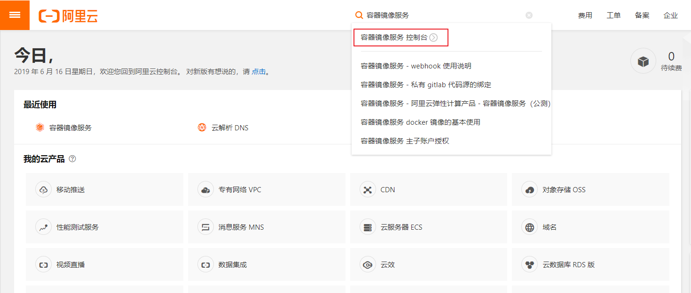
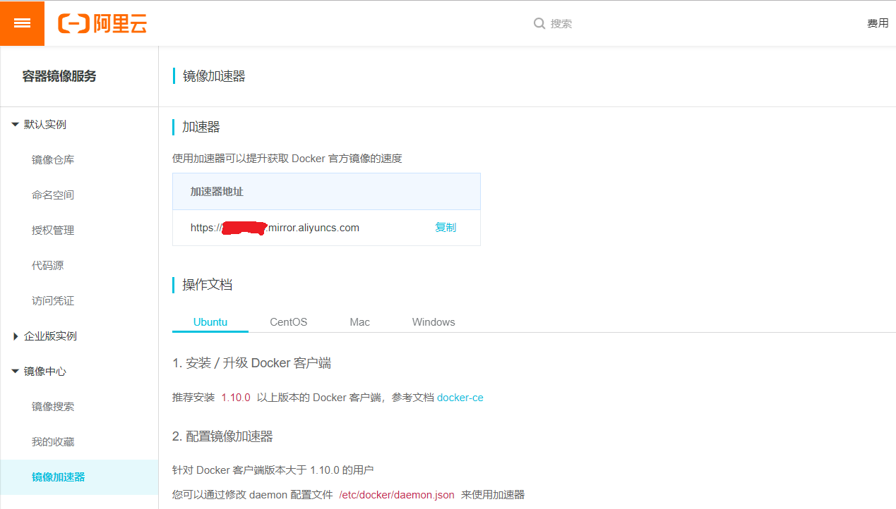
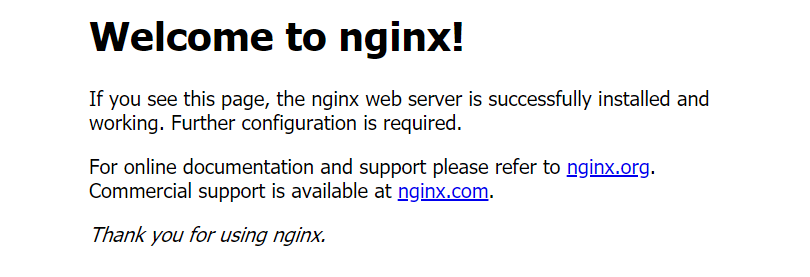

## 平台支持

Docker CE 支持多种平台，如下表所示

### 桌面

平台 | 架构
---|---
[Docker Desktop for Mac (macOS)](https://docs.docker.com/docker-for-mac/install/) | X64
[Docker Desktop for Windows (Microsoft Windows 10)](https://docs.docker.com/docker-for-windows/install/) | X64

### 服务器

平台 | x86_64 / amd64 | ARM | ARM64 / AARCH64 | IBM Power (ppc64le) | IBM Z (s390x)
---|---|---|---|---|---
[CentOS](https://docs.docker.com/install/linux/docker-ce/centos/) | ✔ |  | ✔		
[Debian](https://docs.docker.com/install/linux/docker-ce/debian/) | ✔ | ✔ | ✔		
[Fedora](https://docs.docker.com/install/linux/docker-ce/fedora/) | ✔ |  | ✔		
[Ubuntu](https://docs.docker.com/install/linux/docker-ce/ubuntu/) | ✔ | ✔ | ✔	| ✔ | ✔

## 准备安装

### 卸载旧版本

~~~
apt-get remove docker docker-engine docker.io containerd runc
~~~

### 使用 APT 安装

~~~
# 更新数据源
apt-get update

# 安装所需依赖
apt-get -y install apt-transport-https ca-certificates curl software-properties-common

# 安装 GPG 证书
curl -fsSL http://mirrors.aliyun.com/docker-ce/linux/ubuntu/gpg | sudo apt-key add -

# 新增数据源
add-apt-repository "deb [arch=amd64] http://mirrors.aliyun.com/docker-ce/linux/ubuntu $(lsb_release -cs) stable"

# 更新并安装 Docker CE
apt-get update && apt-get install -y docker-ce
~~~

### 验证安装是否成功

~~~
docker version

# 输出如下
Client:
 Version:           18.09.6
 API version:       1.39
 Go version:        go1.10.8
 Git commit:        481bc77
 Built:             Sat May  4 02:35:57 2019
 OS/Arch:           linux/amd64
 Experimental:      false
Server: Docker Engine - Community
 Engine:
  Version:          18.09.6
  API version:      1.39 (minimum version 1.12)
  Go version:       go1.10.8
  Git commit:       481bc77
  Built:            Sat May  4 01:59:36 2019
  OS/Arch:          linux/amd64
  Experimental:     false
~~~

## 配置 Docker 镜像加速器

### 阿里云加速器（推荐）

[点击链接获取](https://www.aliyun.com)

### 官方提供中国区镜像

~~~
https://registry.docker-cn.com
~~~

### 配置加速器

以配置阿里云加速器为例，首先 [登录阿里云（没有账号请先注册）](https://www.aliyun.com)，搜索 容器镜像服务

找到你的专属加速器

通过修改 daemon 配置文件 ==/etc/docker/daemon.json== 来使用加速器

~~~
tee /etc/docker/daemon.json <<-'EOF'
{
  "registry-mirrors": ["https://xxxxxxxx.mirror.aliyuncs.com"]
}
EOF
# 重启 Docker
systemctl daemon-reload
systemctl restart docker
~~~

### 验证配置是否成功

~~~
docker info

# 输出如下
Containers: 38
 Running: 18
 Paused: 0
 Stopped: 20
Images: 10
Server Version: 18.09.6
Storage Driver: overlay2
 Backing Filesystem: extfs
 Supports d_type: true
 Native Overlay Diff: true
Logging Driver: json-file
Cgroup Driver: cgroupfs
Plugins:
 Volume: local
 Network: bridge host macvlan null overlay
 Log: awslogs fluentd gcplogs gelf journald json-file local logentries splunk syslog
Swarm: inactive
Runtimes: runc
Default Runtime: runc
Init Binary: docker-init
containerd version: bb71b10fd8f58240ca47fbb579b9d1028eea7c84
runc version: 2b18fe1d885ee5083ef9f0838fee39b62d653e30
init version: fec3683
Security Options:
 apparmor
 seccomp
  Profile: default
Kernel Version: 4.15.0-51-generic
Operating System: Ubuntu 18.04.2 LTS
OSType: linux
Architecture: x86_64
CPUs: 2
Total Memory: 1.924GiB
Name: kubernetes-master
ID: PJ4H:7AF2:P5UT:6FMR:W4DI:SSWR:IQQR:J6QO:ARES:BOAC:ZVMO:SV2Y
Docker Root Dir: /var/lib/docker
Debug Mode (client): false
Debug Mode (server): false
Registry: https://index.docker.io/v1/
Labels:
Experimental: false
Insecure Registries:
 127.0.0.0/8
## 这里是你配置的镜像加速器
Registry Mirrors:
 https://xxxxxxxx.mirror.aliyuncs.com/
Live Restore Enabled: false
Product License: Community Engine
WARNING: No swap limit support
~~~

## 运行第一个容器

我们以 Nginx 为例，体验 Docker 是如何运行容器的

~~~
# 下载镜像
docker pull nginx

# 运行容器
docker run --name nginx-container -p 80:80 -d nginx
~~~

浏览器输入虚拟机地址即可访问 Nginx

## 其它安装方法

- 安装命令

~~~
sudo apt install docker.io
~~~

- 解决普通用户不能直接使用 docker 命令

~~~
docker ps
Got permission denied while trying to connect to the Docker daemon socket at unix:///var/run/docker.sock: Get http://%2Fvar%2Frun%2Fdocker.sock/v1.39/containers/json: dial unix /var/run/docker.sock: connect: permission denied
~~~

~~~
# 创建 docker 用户组
sudo groupadd docker

# 添加当前用户到 docker 组
sudo usermod -aG docker $USER

# 重启 docker
sudo systemctl restart docker
newgrp - docker

# 重启系统
sudo reboot
~~~

---
