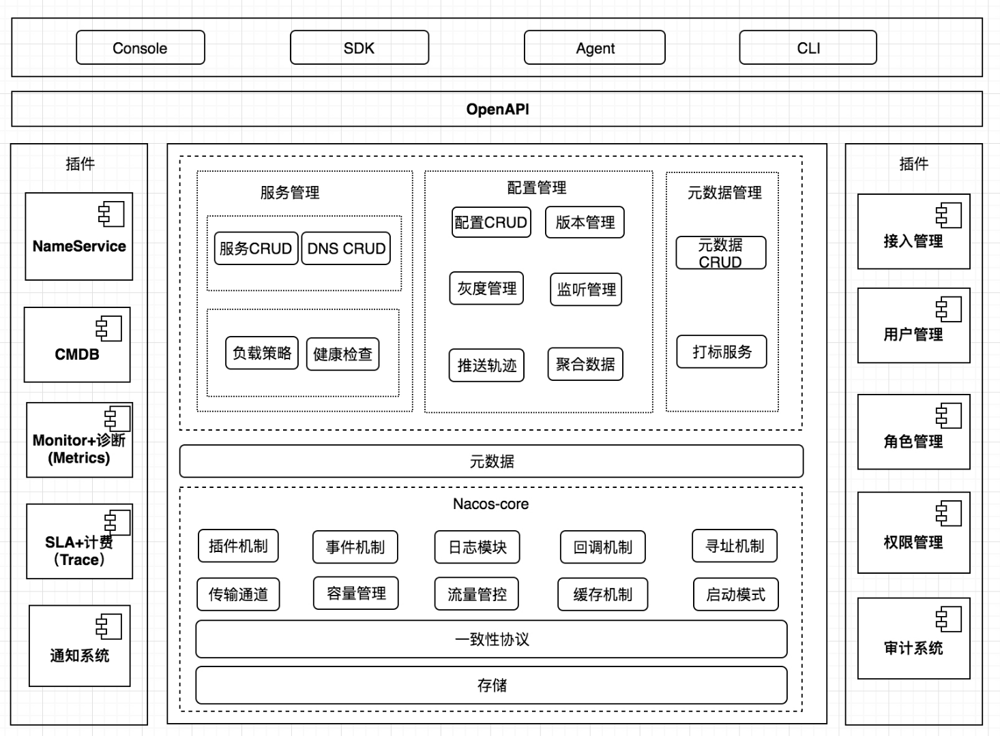

### 概述

Nacos 致力于帮助您发现、配置和管理微服务。Nacos 提供了一组简单易用的特性集，帮助您快速实现动态服务发现、服务配置、服务元数据及流量管理。

Nacos 帮助您更敏捷和容易地构建、交付和管理微服务平台。 Nacos 是构建以 “服务” 为中心的现代应用架构 (例如微服务范式、云原生范式) 的服务基础设施。

[Nacos 官网](https://nacos.io/zh-cn/index.html)

### 关键特性

#### 服务发现和服务健康监测

Nacos 支持基于 DNS 和基于 RPC 的服务发现。服务提供者使用 原生 SDK、OpenAPI、或一个 独立的 Agent TODO 注册 Service 后，服务消费者可以使用 DNS TODO 或 HTTP&API 查找和发现服务。

Nacos 提供对服务的实时的健康检查，阻止向不健康的主机或服务实例发送请求。Nacos 支持传输层 (PING 或 TCP) 和应用层 (如 HTTP、MySQL、用户自定义）的健康检查。 对于复杂的云环境和网络拓扑环境中（如 VPC、边缘网络等）服务的健康检查，Nacos 提供了 agent 上报模式和服务端主动检测 2 种健康检查模式。Nacos 还提供了统一的健康检查仪表盘，帮助您根据健康状态管理服务的可用性及流量。

#### 动态配置服务

动态配置服务可以让您以中心化、外部化和动态化的方式管理所有环境的应用配置和服务配置。动态配置消除了配置变更时重新部署应用和服务的需要，让配置管理变得更加高效和敏捷。配置中心化管理让实现无状态服务变得更简单，让服务按需弹性扩展变得更容易。

Nacos 提供了一个简洁易用的 UI 帮助您管理所有的服务和应用的配置。Nacos 还提供包括配置版本跟踪、金丝雀发布、一键回滚配置以及客户端配置更新状态跟踪在内的一系列开箱即用的配置管理特性，帮助您更安全地在生产环境中管理配置变更和降低配置变更带来的风险。

#### 动态 DNS 服务

动态 DNS 服务支持权重路由，让您更容易地实现中间层负载均衡、更灵活的路由策略、流量控制以及数据中心内网的简单 DNS 解析服务。动态 DNS 服务还能让您更容易地实现以 DNS 协议为基础的服务发现，以帮助您消除耦合到厂商私有服务发现 API 上的风险。

Nacos 提供了一些简单的 DNS APIs TODO 帮助您管理服务的关联域名和可用的 IP:PORT 列表.

#### 服务及其元数据管理

Nacos 能让您从微服务平台建设的视角管理数据中心的所有服务及元数据，包括管理服务的描述、生命周期、服务的静态依赖分析、服务的健康状态、服务的流量管理、路由及安全策略、服务的 SLA 以及最首要的 metrics 统计数据。

#### Nacos 地图

- 特性大图：要从功能特性，非功能特性，全面介绍我们要解的问题域的特性诉求

- 架构大图：通过清晰架构，让您快速进入 Nacos 世界

- 业务大图：利用当前特性可以支持的业务场景，及其最佳实践

- 生态大图：系统梳理 Nacos 和主流技术生态的关系

- 优势大图：展示 Nacos 核心竞争力

- 战略大图：要从战略到战术层面讲 Nacos 的宏观优势

### Nacos 架构

#### 基本架构及概念

[link](http://m.qpic.cn/psc?/V12rWk0x0BKclG/WmaLtG4DKwtTVCYYotv*PbXjh3yI9jRdpXnN2DJ3qXHa*duhkg1Fz4Ef5buVABX2vMzwey8W5534E0tZqHetD3RFhTH*m7OLTfmrQOKdD4o!/b&bo=TAT0AQAAAAARF50!&rf=viewer_4)

#### 服务 (Service)

服务是指一个或一组软件功能（例如特定信息的检索或一组操作的执行），其目的是不同的客户端可以为不同的目的重用（例如通过跨进程的网络调用）。Nacos 支持主流的服务生态，如 Kubernetes Service、gRPC|Dubbo RPC Service 或者 Spring Cloud RESTful Service.

#### 服务注册中心 (Service Registry)

服务注册中心，它是服务，其实例及元数据的数据库。服务实例在启动时注册到服务注册表，并在关闭时注销。服务和路由器的客户端查询服务注册表以查找服务的可用实例。服务注册中心可能会调用服务实例的健康检查 API 来验证它是否能够处理请求。

#### 服务元数据 (Service Metadata)

服务元数据是指包括服务端点 (endpoints)、服务标签、服务版本号、服务实例权重、路由规则、安全策略等描述服务的数据

#### 服务提供方 (Service Provider)

是指提供可复用和可调用服务的应用方

#### 服务消费方 (Service Consumer)

是指会发起对某个服务调用的应用方

#### 配置 (Configuration)

在系统开发过程中通常会将一些需要变更的参数、变量等从代码中分离出来独立管理，以独立的配置文件的形式存在。目的是让静态的系统工件或者交付物（如 WAR，JAR 包等）更好地和实际的物理运行环境进行适配。配置管理一般包含在系统部署的过程中，由系统管理员或者运维人员完成这个步骤。配置变更是调整系统运行时的行为的有效手段之一。

#### 配置管理 (Configuration Management)

在数据中心中，系统中所有配置的编辑、存储、分发、变更管理、历史版本管理、变更审计等所有与配置相关的活动统称为配置管理。

#### 名字服务 (Naming Service)

提供分布式系统中所有对象 (Object)、实体 (Entity) 的 “名字” 到关联的元数据之间的映射管理服务，例如 ServiceName -> Endpoints Info, Distributed Lock Name -> Lock Owner/Status Info, DNS Domain Name -> IP List, 服务发现和 DNS 就是名字服务的 2 大场景。

#### 配置服务 (Configuration Service)

在服务或者应用运行过程中，提供动态配置或者元数据以及配置管理的服务提供者。

#### 逻辑架构及其组件介绍

- **服务管理**： 实现服务 CRUD，域名 CRUD，服务健康状态检查，服务权重管理等功能

- **配置管理**： 实现配置管 CRUD，版本管理，灰度管理，监听管理，推送轨迹，聚合数据等功能

- **元数据管理**： 提供元数据 CURD 和打标能力

- **插件机制**： 实现三个模块可分可合能力，实现扩展点 SPI 机制

- **事件机制**： 实现异步化事件通知，sdk 数据变化异步通知等逻辑

- **日志模块**： 管理日志分类，日志级别，日志可移植性（尤其避免冲突），日志格式，异常码 + 帮助文档

- **回调机制**： sdk 通知数据，通过统一的模式回调用户处理。接口和数据结构需要具备可扩展性

- **寻址模式**： 解决 ip，域名，nameserver、广播等多种寻址模式，需要可扩展

- **推送通道**： 解决 server 与存储、server 间、server 与 sdk 间推送性能问题

- **容量管理**： 管理每个租户，分组下的容量，防止存储被写爆，影响服务可用性

- **流量管理**： 按照租户，分组等多个维度对请求频率，长链接个数，报文大小，请求流控进行控制

- **缓存机制**： 容灾目录，本地缓存，server 缓存机制。容灾目录使用需要工具

- **启动模式**： 按照单机模式，配置模式，服务模式，dns 模式，或者 all 模式，启动不同的程序 + UI

- **一致性协议**： 解决不同数据，不同一致性要求情况下，不同一致性机制

- **存储模块**： 解决数据持久化、非持久化存储，解决数据分片问题

- **Nameserver**： 解决 namespace 到 clusterid 的路由问题，解决用户环境与 nacos 物理环境映射问题

- **CMDB**： 解决元数据存储，与三方 cmdb 系统对接问题，解决应用，人，资源关系

- **Metrics**： 暴露标准 metrics 数据，方便与三方监控系统打通

- **Trace**： 暴露标准 trace，方便与 SLA 系统打通，日志白平化，推送轨迹等能力，并且可以和计量计费系统打通

- **接入管理**： 相当于阿里云开通服务，分配身份、容量、权限过程

- **用户管理**： 解决用户管理，登录，sso 等问题

- **权限管理**： 解决身份识别，访问控制，角色管理等问题

- **审计系统**： 扩展接口方便与不同公司审计系统打通

- **通知系统**： 核心数据变更，或者操作，方便通过 SMS 系统打通，通知到对应人数据变更

- **OpenAPI**： 暴露标准 Rest 风格 HTTP 接口，简单易用，方便多语言集成

- **Console**： 易用控制台，做服务管理、配置管理等操作

- **SDK**： 多语言 sdk

- **Agent**： dns-f 类似模式，或者与 mesh 等方案集成

- **CLI**： 命令行对产品进行轻量化管理，像 git 一样好用

---
