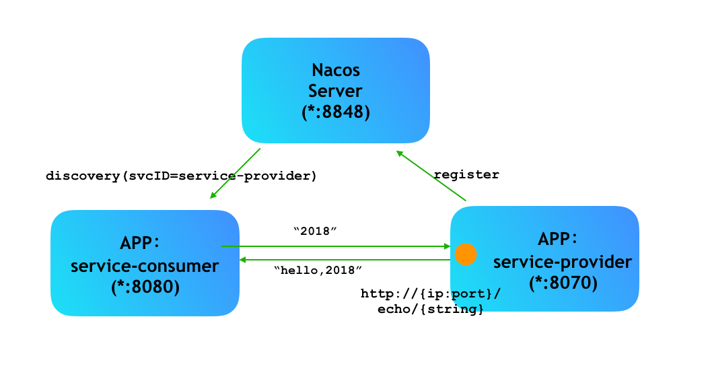

### 概述

```
服务注册中心： 存储服务实例和服务负载均衡策略的数据库
```

本节通过实现一个简单的 echo service 演示如何在您的 Spring Cloud 项目中启用 Nacos 的服务发现功能，如下图示:



### 服务提供者

```
服务提供方： 是指提供可复用和可调用服务的应用方
```

##### POM

创建一个名为 hello-spring-cloud-alibaba-provider 的服务提供者项目，pom.xml 配置如下：

```
<?xml version="1.0" encoding="UTF-8"?>
<project xmlns="http://maven.apache.org/POM/4.0.0" xmlns:xsi="http://www.w3.org/2001/XMLSchema-instance"
         xsi:schemaLocation="http://maven.apache.org/POM/4.0.0 http://maven.apache.org/xsd/maven-4.0.0.xsd">
    <modelVersion>4.0.0</modelVersion>

    <parent>
        <groupId>com.funtl</groupId>
        <artifactId>hello-spring-cloud-alibaba</artifactId>
        <version>0.0.1-SNAPSHOT</version>
        <relativePath>../pom.xml</relativePath>
    </parent>

    <artifactId>hello-spring-cloud-alibaba-provider</artifactId>
    <packaging>jar</packaging>
    <url>http://www.funtl.com</url>
    <inceptionYear>2018-Now</inceptionYear>

    <licenses>
        <license>
            <name>Apache 2.0</name>
            <url>https://www.apache.org/licenses/LICENSE-2.0.txt</url>
        </license>
    </licenses>

    <developers>
        <developer>
            <id>liwemin</id>
            <name>Lusifer Lee</name>
            <email>lee.lusifer@gmail.com</email>
        </developer>
    </developers>
    
    <dependencies>
        <!-- Spring Boot Begin -->
        <dependency>
            <groupId>org.springframework.boot</groupId>
            <artifactId>spring-boot-starter-web</artifactId>
        </dependency>
        <dependency>
            <groupId>org.springframework.boot</groupId>
            <artifactId>spring-boot-starter-actuator</artifactId>
        </dependency>
        <dependency>
            <groupId>org.springframework.boot</groupId>
            <artifactId>spring-boot-starter-test</artifactId>
            <scope>test</scope>
        </dependency>
        <!-- Spring Boot End -->
        
        <!-- Spring Cloud Begin -->
        <dependency>
            <groupId>org.springframework.cloud</groupId>
            <artifactId>spring-cloud-starter-alibaba-nacos-discovery</artifactId>
        </dependency>
        <!-- Spring Cloud End -->
    </dependencies>
    
    <build>
        <plugins>
            <plugin>
                <groupId>org.springframework.boot</groupId>
                <artifactId>spring-boot-maven-plugin</artifactId>
                <configuration>
                    <mainClass>com.funtl.spring.cloud.alibaba.provider.ProviderApplication</mainClass>
                </configuration>
            </plugin>
        </plugins>
    </build>
</project>    
```

##### application.yml

在 application.yml 中配置 Nacos Server 的地址

```
spring:
  application:
    # 服务名
    name: service-provider
  cloud:
    nacos:
      discovery:
        # 服务注册中心
        server-addr: 192.168.141.132:8848

server:
  # 服务端口
  port: 8070
  
management:
  # 端点检查（健康检查）
  endpoints:
    web:
      exposure:
        include: "*"  
```

##### Application

通过 Spring Cloud 原生注解 @EnableDiscoveryClient 开启服务注册发现功能

```
package com.funtl.spring.cloud.alibaba.provider;

import org.springframework.boot.SpringApplication;
import org.springframework.boot.autoconfigure.SpringBootApplication;
import org.springframework.cloud.client.discovery.EnableDiscoveryClient;

@SpringBootApplication
@EnableDiscoveryClient
public class ProviderApplication {
    public static void main(String[] args) {
        SpringApplication.run(ProviderApplication.class, args);
    }
}
```

##### Controller

编写一个 RestController 提供 RESTFul API 用于测试提供者

```
package com.funtl.spring.cloud.alibaba.provider.controller;

import org.springframework.web.bind.annotation.GetMapping;
import org.springframework.web.bind.annotation.PathVariable;
import org.springframework.web.bind.annotation.RestController;

@RestController
public class EchoController {

    @GetMapping(value = "/echo/{string}")
    public String echo(@PathVariable String string) {
        return "Hello Nacos Provider " + string;
    }
    
}
```

##### 验证是否成功

通过浏览器访问 http://ip:8848/nacos Nacos Server 网址


你会发现一个服务已经注册在服务中了，服务名为 service-provider，通过浏览器访问 http://localhost:8070/echo/hi

```
Hello Nacos Provider hi
```

##### 服务端点检查

**健康检查**： 以指定方式检查服务下挂载的实例 (Instance) 的健康度，从而确认该实例 (Instance) 是否能提供服务。根据检查结果，实例 (Instance) 会被判断为健康或不健康。对服务发起解析请求时，不健康的实例 (Instance) 不会返回给客户端。

通过浏览器访问 http://localhost:8070/actuator/nacos-discovery

```
{
    "subscribe": [
        {
            "jsonFromServer": "",
            "name": "service-provider",
            "groupName": "DEFAULT_GROUP",
            "clusters": null,
            "cacheMillis": 1000,
            "hosts": [],
            "lastRefTime": 0,
            "checksum": "",
            "allIPs": false,
            "key": "service-provider",
            "valid": true,
            "keyEncoded": "service-provider"
        },
        {
            "jsonFromServer": "",
            "name": "service-consumer",
            "groupName": "DEFAULT_GROUP",
            "clusters": null,
            "cacheMillis": 1000,
            "hosts": [],
            "lastRefTime": 0,
            "checksum": "",
            "allIPs": false,
            "key": "service-consumer",
            "valid": true,
            "keyEncoded": "service-consumer"
        }
    ],
    "NacosDiscoveryProperties": {
        "serverAddr": "192.168.141.132:8848",
        "endpoint": "",
        "namespace": "",
        "watchDelay": 30000,
        "logName": "",
        "service": "service-provider",
        "weight": 1,
        "clusterName": "DEFAULT",
        "namingLoadCacheAtStart": "false",
        "metadata": {
            "preserved.register.source": "SPRING_CLOUD"
        },
        "registerEnabled": true,
        "ip": "192.168.141.1",
        "networkInterface": "",
        "port": 8070,
        "secure": false,
        "accessKey": "",
        "secretKey": ""
    }
}
```

----

### 服务消费者

**服务消费方**： 是指会发起对某个服务调用的应用方

服务消费者的创建与服务提供者大同小异，这里采用最原始的一种方式，即显示的使用 **LoadBalanceClient** 和 **RestTemplate** 结合的方式来访问

##### POM

创建一个名为 hello-spring-cloud-alibaba-consumer 的服务消费者项目，pom.xml 配置如下：

```
<?xml version="1.0" encoding="UTF-8"?>
<project xmlns="http://maven.apache.org/POM/4.0.0" xmlns:xsi="http://www.w3.org/2001/XMLSchema-instance"
         xsi:schemaLocation="http://maven.apache.org/POM/4.0.0 http://maven.apache.org/xsd/maven-4.0.0.xsd">
    <modelVersion>4.0.0</modelVersion>
    
    <parent>
        <groupId>com.funtl</groupId>
        <artifactId>hello-spring-cloud-alibaba</artifactId>
        <version>0.0.1-SNAPSHOT</version>
        <relativePath>../pom.xml</relativePath>
    </parent>
    
    <artifactId>hello-spring-cloud-alibaba-consumer</artifactId>
    <packaging>jar</packaging>
    <url>http://www.funtl.com</url>
    <inceptionYear>2018-Now</inceptionYear>    
    
    <licenses>
        <license>
            <name>Apache 2.0</name>
            <url>https://www.apache.org/licenses/LICENSE-2.0.txt</url>
        </license>
    </licenses>    

    <developers>
        <developer>
            <id>liwemin</id>
            <name>Lusifer Lee</name>
            <email>lee.lusifer@gmail.com</email>
        </developer>
    </developers>
    
    <dependencies>
        <!-- Spring Boot Begin -->
        <dependency>
            <groupId>org.springframework.boot</groupId>
            <artifactId>spring-boot-starter-web</artifactId>
        </dependency>
        <dependency>
            <groupId>org.springframework.boot</groupId>
            <artifactId>spring-boot-starter-actuator</artifactId>
        </dependency>
        <dependency>
            <groupId>org.springframework.boot</groupId>
            <artifactId>spring-boot-starter-test</artifactId>
            <scope>test</scope>
        </dependency>
        <!-- Spring Boot End -->
        
        <!-- Spring Cloud Begin -->
        <dependency>
            <groupId>org.springframework.cloud</groupId>
            <artifactId>spring-cloud-starter-alibaba-nacos-discovery</artifactId>
        </dependency>
        <!-- Spring Cloud End -->
    </dependencies>
    
    <build>
        <plugins>
            <plugin>
                <groupId>org.springframework.boot</groupId>
                <artifactId>spring-boot-maven-plugin</artifactId>
                <configuration>
                    <mainClass>com.funtl.spring.cloud.alibaba.consumer.ConsumerApplication</mainClass>
                </configuration>
            </plugin>
        </plugins>
    </build>
</project>  
```

##### application.yml

在 application.yml 中配置 Nacos Server 的地址

```
spring:
  application:
    # 服务名
    name: service-consumer
  cloud:
    nacos:
      discovery:
        # 服务注册中心
        server-addr: 192.168.141.132:8848

server:
  # 服务端口
  port: 8080        

management:
  # 端点检查（健康检查）
  endpoints:
    web:
      exposure:
        include: "*"
```

##### Application

通过 Spring Cloud 原生注解 @EnableDiscoveryClient 开启服务注册发现功能

```
package com.funtl.spring.cloud.alibaba.consumer;

import org.springframework.boot.SpringApplication;
import org.springframework.boot.autoconfigure.SpringBootApplication;
import org.springframework.cloud.client.discovery.EnableDiscoveryClient;

@SpringBootApplication
@EnableDiscoveryClient
public class ConsumerApplication {
    public static void main(String[] args) {
        SpringApplication.run(ConsumerApplication.class, args);
    }
}
```

##### Configuration

创建一个 **Java 配置类**，主要作用是为了注入 **RestTemplate**

```
package com.funtl.spring.cloud.alibaba.consumer.configure;

import org.springframework.cloud.client.loadbalancer.LoadBalanced;
import org.springframework.context.annotation.Bean;
import org.springframework.context.annotation.Configuration;
import org.springframework.web.client.RestTemplate;

@Configuration
public class ConsumerConfiguration {
    @Bean
    @LoadBalanced
    public RestTemplate restTemplate() {
        return new RestTemplate();
    }
}
```

##### Controller

```
package com.funtl.spring.cloud.alibaba.consumer.controller;

import org.springframework.beans.factory.annotation.Autowired;
import org.springframework.web.bind.annotation.GetMapping;
import org.springframework.web.bind.annotation.PathVariable;
import org.springframework.web.bind.annotation.RestController;
import org.springframework.web.client.RestTemplate;

@RestController
public class TestController {

    private final RestTemplate restTemplate;
    
    @Autowired
    public TestController(RestTemplate restTemplate) {
        this.restTemplate = restTemplate;
    }    

    @GetMapping(value = "/echo/{str}")
    public String echo(@PathVariable String str) {
        // 使用服务名请求服务提供者
        return restTemplate.getForObject("http://service-provider/echo/" + str, String.class);
    }
}
```

##### 验证是否成功

通过浏览器访问 http://ip:8848/nacos Nacos Server 网址


你会发现一个服务已经注册在服务中了，服务名为 service-consumer，通过浏览器访问 http://localhost:8080/echo/hi

```
Hello Nacos Provider hi
```

##### 服务端点检查

通过浏览器访问 http://localhost:8080/actuator/nacos-discovery

```
{
    "subscribe": [
        {
            "jsonFromServer": "",
            "name": "service-provider",
            "groupName": "DEFAULT_GROUP",
            "clusters": null,
            "cacheMillis": 1000,
            "hosts": [],
            "lastRefTime": 0,
            "checksum": "",
            "allIPs": false,
            "key": "service-provider",
            "valid": true,
            "keyEncoded": "service-provider"
        },
        {
            "jsonFromServer": "",
            "name": "service-consumer",
            "groupName": "DEFAULT_GROUP",
            "clusters": null,
            "cacheMillis": 1000,
            "hosts": [],
            "lastRefTime": 0,
            "checksum": "",
            "allIPs": false,
            "key": "service-consumer",
            "valid": true,
            "keyEncoded": "service-consumer"
        }
    ],
    "NacosDiscoveryProperties": {
        "serverAddr": "192.168.141.132:8848",
        "endpoint": "",
        "namespace": "",
        "watchDelay": 30000,
        "logName": "",
        "service": "service-consumer",
        "weight": 1,
        "clusterName": "DEFAULT",
        "namingLoadCacheAtStart": "false",
        "metadata": {
            "preserved.register.source": "SPRING_CLOUD"
        },
        "registerEnabled": true,
        "ip": "192.168.141.1",
        "networkInterface": "",
        "port": 8080,
        "secure": false,
        "accessKey": "",
        "secretKey": ""
    }
}
```
