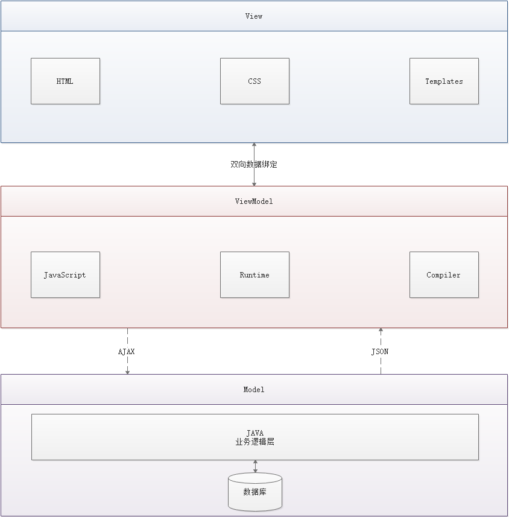

### 什么是 MVVM

MVVM（Model-View-ViewModel）是一种软件架构设计模式，由微软 WPF（用于替代 WinForm，以前就是用这个技术开发桌面应用程序的）和 Silverlight（类似于 Java Applet，简单点说就是在浏览器上运行的 WPF） 的架构师 Ken Cooper 和 Ted Peters 开发，是一种简化用户界面的**事件驱动编程方式**。由 John Gossman（同样也是 WPF 和 Silverlight 的架构师）于 2005 年在他的博客上发表。

MVVM 源自于经典的 MVC（Model-View-Controller）模式（期间还演化出了 MVP（Model-View-Presenter） 模式）。**MVVM 的核心是 ViewModel 层**，负责转换 Model 中的数据对象来让数据变得更容易管理和使用，其作用如下：

- 该层向上与视图层进行双向数据绑定

- 向下与 Model 层通过接口请求进行数据交互

MVVM 已经相当成熟了，主要运用但不仅仅在网络应用程序开发中。当下流行的 MVVM 框架有 **Vue.js**，**AngularJS** 等。

### 为什么要使用 MVVM

- **低耦合**： 视图（View）可以独立于 Model 变化和修改，一个 ViewModel 可以绑定到不同的 View 上，当 View 变化的时候 Model 可以不变，当 Model 变化的时候 View 也可以不变。

- **可复用**： 你可以把一些视图逻辑放在一个 ViewModel 里面，让很多 View 重用这段视图逻辑。

- **独立开发**： 开发人员可以专注于业务逻辑和数据的开发（ViewModel），设计人员可以专注于页面设计。

- **可测试**： 界面素来是比较难于测试的，而现在测试可以针对 ViewModel 来写。

### MVVM 的组成部分

### View

View 是视图层，也就是用户界面。前端主要由 HTML 和 CSS 来构建，为了更方便地展现 ViewModel 或者 Model 层的数据，已经产生了各种各样的前后端模板语言，比如 **FreeMarker**、**Thymeleaf** 等等，各大 MVVM 框架如 **Vue.js**，**AngularJS**，**EJS** 等也都有自己用来构建用户界面的内置模板语言。

### Model

Model 是指数据模型，泛指后端进行的各种业务逻辑处理和数据操控，主要围绕数据库系统展开。这里的难点主要在于需要和前端约定统一的 **接口规则**

### ViewModel

ViewModel 是由前端开发人员组织生成和维护的视图数据层。在这一层，前端开发者对从后端获取的 Model 数据进行转换处理，做二次封装，以生成符合 View 层使用预期的视图数据模型。

**需要注意的是 ViewModel 所封装出来的数据模型包括视图的状态和行为两部分，而 Model 层的数据模型是只包含状态的**

- 比如页面的这一块展示什么，那一块展示什么这些都属于视图状态（展示）

- 页面加载进来时发生什么，点击这一块发生什么，这一块滚动时发生什么这些都属于视图行为（交互）

视图状态和行为都封装在了 ViewModel 里。这样的封装使得 ViewModel 可以完整地去描述 View 层 **由于实现了双向绑定，ViewModel 的内容会实时展现在 View 层，这是激动人心的，因为前端开发者再也不必低效又麻烦地通过操纵 DOM 去更新视图**

MVVM 框架已经把最脏最累的一块做好了，我们开发者只需要处理和维护 ViewModel，更新数据视图就会自动得到相应更新，真正实现 **事件驱动编程**。

View 层展现的不是 **Model** 层的数据，而是 **ViewModel** 的数据，由 **ViewModel** 负责与 **Model** 层交互，**这就完全解耦了 View 层和 Model 层，这个解耦是至关重要的，它是前后端分离方案实施的重要一环**。
