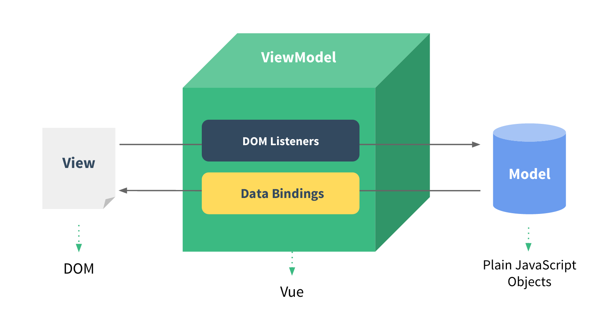
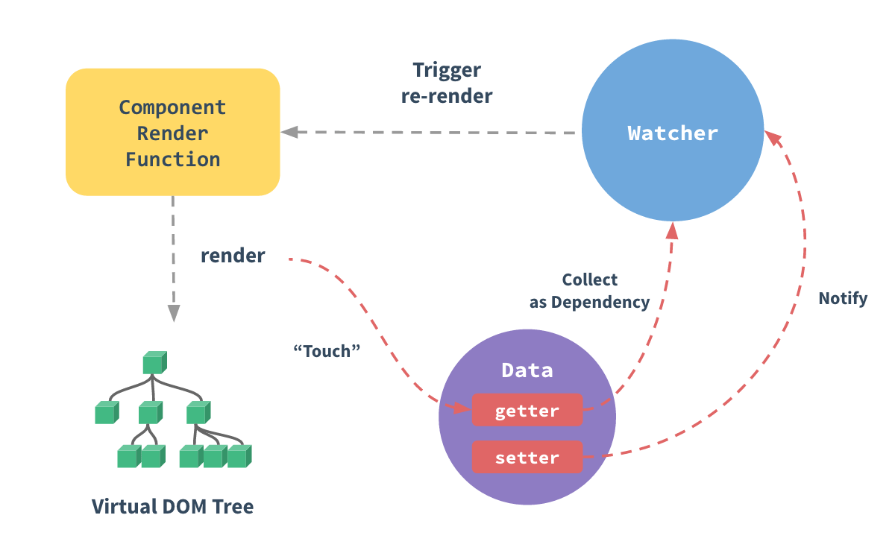

### 概述

Vue (读音 /vjuː/，类似于 view) 是一套用于构建用户界面的渐进式框架，发布于 2014 年 2 月。与其它大型框架不同的是，Vue 被设计为可以自底向上逐层应用。**Vue 的核心库只关注视图层**，不仅易于上手，还便于与第三方库（如：**vue-router**，**vue-resource**，**vuex**）或既有项目整合。

[官方网站](http://www.qfdmy.com/wp-content/themes/quanbaike/go.php?url=aHR0cHM6Ly9jbi52dWVqcy5vcmcv)

### MVVM 模式的实现者

我们知道 MVVM 表示如下：

- Model：模型层，在这里表示 JavaScript 对象

- View：视图层，在这里表示 DOM（HTML 操作的元素）

- ViewModel：连接视图和数据的中间件，**Vue.js 就是 MVVM 中的 ViewModel 层的实现者**

在 MVVM 架构中，是不允许 **数据** 和 **视图** 直接通信的，只能通过 **ViewModel** 来通信，而 ViewModel 就是定义了一个 **Observer** 观察者

- ViewModel 能够观察到数据的变化，并对视图对应的内容进行更新

- ViewModel 能够监听到视图的变化，并能够通知数据发生改变

至此，我们就明白了，Vue.js 就是一个 MVVM 的实现者，他的核心就是实现了 **DOM 监听** 与 **数据绑定**

### 其它 MVVM 实现者

- AngularJS

- ReactJS

- 微信小程序

### 为什么要使用 Vue.js

- 轻量级，体积小是一个重要指标。Vue.js 压缩后有只有 **20多kb** （Angular 压缩后 **56kb+**，React 压缩后 **44kb+**）

- 移动优先。更适合移动端，比如移动端的 Touch 事件

- 易上手，学习曲线平稳，文档齐全

- 吸取了 Angular（**模块化**）和 React（**虚拟 DOM**）的长处，并拥有自己独特的功能，如：**计算属性**

- 开源，社区活跃度高

### Vue.js 的两大核心要素    

#### 数据驱动

当你把一个普通的 JavaScript 对象传给 Vue 实例的 **data** 选项，Vue 将遍历此对象所有的属性，并使用 **Object.defineProperty** 把这些属性全部转为 **getter/setter**。**Object.defineProperty 是 ES5 中一个无法 shim 的特性，这也就是为什么 Vue 不支持 IE8 以及更低版本浏览器**。

这些 getter/setter 对用户来说是不可见的，但是在内部它们让 Vue 追踪依赖，在属性被访问和修改时通知变化。这里需要注意的问题是浏览器控制台在打印数据对象时 getter/setter 的格式化并不同，所以你可能需要安装 **vue-devtools** 来获取更加友好的检查接口。

每个组件实例都有相应的 **watcher** 实例对象，它会在组件渲染的过程中把属性记录为依赖，之后当依赖项的 **setter** 被调用时，会通知 **watcher** 重新计算，从而致使它关联的组件得以更新。

#### 组件化

- 页面上每个独立的可交互的区域视为一个组件

- 每个组件对应一个工程目录，组件所需的各种资源在这个目录下就近维护

- 页面不过是组件的容器，组件可以嵌套自由组合（复用）形成完整的页面
