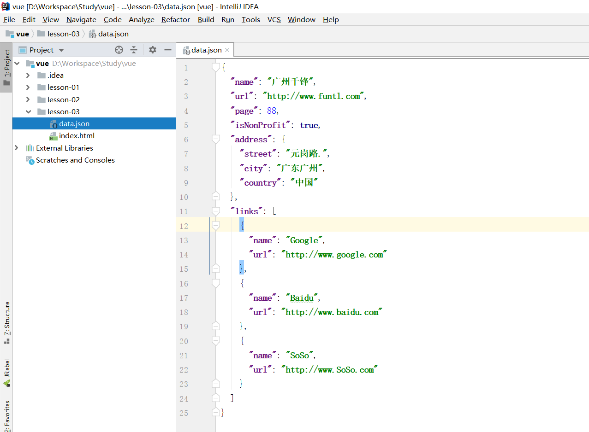
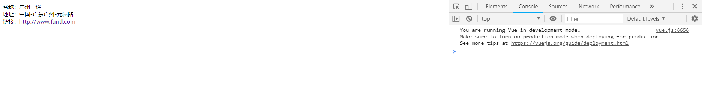

### 什么是 Axios

Axios 是一个开源的可以用在浏览器端和 NodeJS 的异步通信框架，它的主要作用就是实现 AJAX 异步通信，其功能特点如下：

- 从浏览器中创建 **XMLHttpRequests**

- 从 **node.js** 创建 **http** 请求

- 支持 **Promise API**

- 拦截请求和响应

- 转换请求数据和响应数据

- 取消请求

- 自动转换 **JSON** 数据

- 客户端支持防御 **XSRF**（跨站请求伪造）

GitHub：https://github.com/axios/axios

### 为什么要使用 Axios

由于 Vue.js 是一个 **视图层框架** 并且作者（尤雨溪）严格准守 **SoC** （关注度分离原则），所以 Vue.js 并不包含 AJAX 的通信功能，为了解决通信问题，作者单独开发了一个名为 **vue-resource** 的插件，不过在进入 2.0 版本以后停止了对该插件的维护并推荐了 Axios 框架

### 第一个 Axios 应用程序

咱们开发的接口大部分都是采用 JSON 格式，可以先在项目里模拟一段 JSON 数据，数据内容如下：

```
{
  "name": "广州千锋",
  "url": "http://www.funtl.com",
  "page": 88,
  "isNonProfit": true,
  "address": {
    "street": "元岗路.",
    "city": "广东广州",
    "country": "中国"
  },
  "links": [
    {
      "name": "Google",
      "url": "http://www.google.com"
    },
    {
      "name": "Baidu",
      "url": "http://www.baidu.com"
    },
    {
      "name": "SoSo",
      "url": "http://www.SoSo.com"
    }
  ]
}
```

创建一个名为 **data.json** 的文件并填入上面的内容，放在项目的根目录下，如图所示：



### 创建 HTML

```
<div id="vue">
    <div>名称：{{info.name}}</div>
    <div>地址：{{info.address.country}}-{{info.address.city}}-{{info.address.street}}</div>
    <div>链接：<a v-bind:href="info.url" target="_blank">{{info.url}}</a> </div>
</div>
```

> 注意： 在这里使用了 **v-bind** 将 **a:href** 的属性值与 Vue 实例中的数据进行绑定

### 引入 JS 文件

```
<script src="https://cdn.jsdelivr.net/npm/vue"></script>
<script src="https://unpkg.com/axios/dist/axios.min.js"></script>
```

### JavaScript

```
<script type="text/javascript">
    var vm = new Vue({
        el: '#vue',
        data() {
            return {
                info: {
                    name: null,
                    address: {
                        country: null,
                        city: null,
                        street: null
                    },
                    url: null
                }
            }
        },
        mounted() {
            axios
                .get('data.json')
                .then(response => (this.info = response.data));
        }
    });
</script>
```
使用 **axios** 框架的 **get** 方法请求 AJAX 并自动将数据封装进了 Vue 实例的数据对象中

### 数据对象

这里的数据结构与 JSON 数据结构是匹配的

```
info: {
    name: null,
    address: {
        country: null,
        city: null,
        street: null
    },
    url: null
}
```

### 调用 get 请求

调用 **axios** 的 **get** 请求并自动装箱数据

```
axios
    .get('data.json')
    .then(response => (this.info = response.data));
```

### 测试效果



## 完整的 HTML

```
<!DOCTYPE html>
<html>
<head>
    <meta charset="UTF-8">
    <title>网络篇 Axios</title>
    <script src="https://cdn.jsdelivr.net/npm/vue"></script>
    <script src="https://unpkg.com/axios/dist/axios.min.js"></script>
</head>
<body>

<div id="vue">
    <div>名称：{{info.name}}</div>
    <div>地址：{{info.address.country}}-{{info.address.city}}-{{info.address.street}}</div>
    <div>链接：<a v-bind:href="info.url" target="_blank">{{info.url}}</a> </div>
</div>

<script type="text/javascript">
    var vm = new Vue({
        el: '#vue',
        data() {
            return {
                info: {
                    name: null,
                    address: {
                        country: null,
                        city: null,
                        street: null
                    },
                    url: null
                }
            }
        },
        mounted() {
            axios
                .get('data.json')
                .then(response => (this.info = response.data));
        }
    });
</script>
</body>
</html>
```
