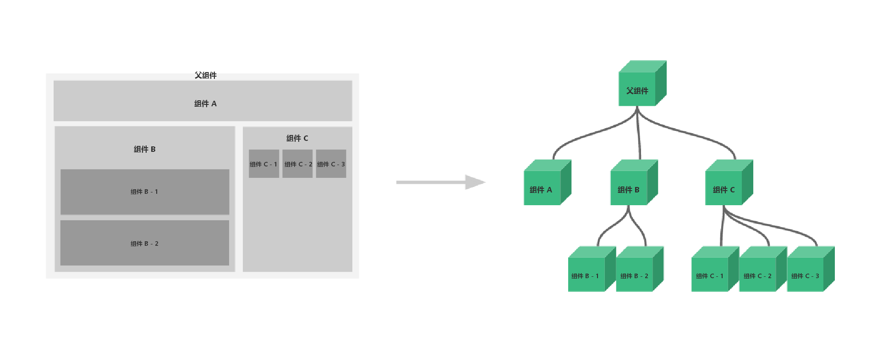

### 什么是组件

组件是可复用的 Vue 实例，说白了就是一组可以重复使用的模板，跟 **JSTL** 的自定义标签、**Thymeleaf** 的 **th:fragment** 以及 **Sitemesh3** 框架有着异曲同工之妙。通常一个应用会以一棵嵌套的组件树的形式来组织：



例如，你可能会有页头、侧边栏、内容区等组件，每个组件又包含了其它的像导航链接、博文之类的组件。

### 第一个 Vue 组件

> 注意：在实际开发中，我们并不会用以下方式开发组件，而是采用 **vue-cli** 创建 **.vue** 模板文件的方式开发，以下方法只是为了让大家理解什么是组件。

### 使用 Vue.component() 方法注册组件

### JavaScript

```
<script type="text/javascript">
    // 先注册组件
    Vue.component('my-component-li', {
        template: '<li>Hello li</li>'
    });
    // 再实例化 Vue
    var vm = new Vue({
        el: '#vue'
    });
</script>
```

### HTML

```
<div id="vue">
    <ul>
        <my-component-li></my-component-li>
    </ul>
</div>
```

### 说明

- **Vue.component()**：注册组件

- **my-component-li**：自定义组件的名字

- **template**：组件的模板

### 测试效果


### 使用 props 属性传递参数

像上面那样用组件没有任何意义，所以我们是需要传递参数到组件的，此时就需要使用 **props** 属性了

> 注意： 默认规则下 **props** 属性里的值不能为大写；感谢来自 Java微服务技术交流群2 的群友 [CV战士蛋蛋面] 帮助大家踩坑；

### JavaScript

```
<script type="text/javascript">
    // 先注册组件
    Vue.component('my-component-li', {
        props: ['item'],
        template: '<li>Hello {{item}}</li>'
    });
    // 再实例化 Vue
    var vm = new Vue({
        el: '#vue',
        data: {
            items: ["张三", "李四", "王五"]
        }
    });
</script>
```

### HTML

```
<div id="vue">
    <ul>
        <my-component-li v-for="item in items" v-bind:item="item"></my-component-li>
    </ul>
</div>
```

### 说明

- **v-for="item in items"**：遍历 Vue 实例中定义的名为 **items** 的数组，并创建同等数量的组件

- **v-bind:item="item"**：将遍历的 **item** 项绑定到组件中 **props** 定义的名为 **item** 属性上；**=** 号左边的 **item** 为 **props** 定义的属性名，右边的为 **item in items** 中遍历的 **item** 项的值

### 测试效果


### 完整的 HTML

```
<!DOCTYPE html>
<html>
<head>
    <meta charset="UTF-8">
    <title>布局篇 组件基础</title>
    <script src="https://cdn.jsdelivr.net/npm/vue"></script>
</head>
<body>

<div id="vue">
    <ul>
        <my-component-li v-for="item in items" v-bind:item="item"></my-component-li>
    </ul>
</div>

<script type="text/javascript">
    // 先注册组件
    Vue.component('my-component-li', {
        props: ['item'],
        template: '<li>Hello {{item}}</li>'
    });
    // 再实例化 Vue
    var vm = new Vue({
        el: '#vue',
        data: {
            items: ["张三", "李四", "王五"]
        }
    });
</script>
</body>
</html>
```
