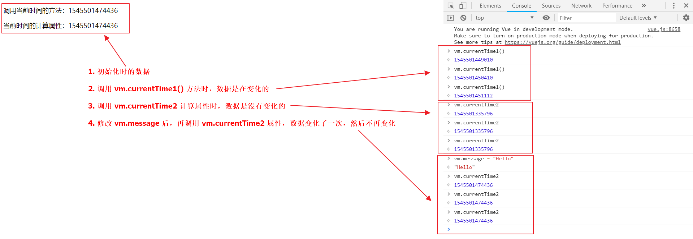

### 什么是计算属性

计算属性的重点突出在 **属性** 两个字上（属性是名词），首先它是个 **属性** 其次这个属性有 **计算** 的能力（**计算是动词**），这里的 **计算** 就是个函数；简单点说，它就是一个能够将计算结果缓存起来的属性（**将行为转化成了静态的属性**），仅此而已；

# 计算属性与方法的区别

### 完整的 HTML

```
<!DOCTYPE html>
<html>
<head>
    <meta charset="UTF-8">
    <title>布局篇 计算属性</title>
    <script src="https://cdn.jsdelivr.net/npm/vue"></script>
</head>
<body>

<div id="vue">
    <p>调用当前时间的方法：{{currentTime1()}}</p>
    <p>当前时间的计算属性：{{currentTime2}}</p>
</div>

<script type="text/javascript">
    var vm = new Vue({
        el: '#vue',
        data: {
            message: 'Hello Vue'
        },
        methods: {
            currentTime1: function () {
                return Date.now();
            }
        },
        computed: {
            currentTime2: function () {
                this.message;
                return Date.now();
            }
        }
    });
</script>
</body>
</html>
```

### 说明

- **methods**：定义方法，调用方法使用 **currentTime1()**，需要带括号

- **computed**：定义计算属性，调用属性使用 **currentTime2**，不需要带括号；**this.message** 是为了能够让 **currentTime2** 观察到数据变化而变化

> 注意： **methods** 和 **computed** 里不能重名

### 测试效果

仔细看图中说明，观察其中的差异
 


### 结论

调用方法时，每次都需要进行计算，既然有计算过程则必定产生系统开销，那如果这个结果是不经常变化的呢？此时就可以考虑将这个结果缓存起来，采用计算属性可以很方便的做到这一点；**计算属性的主要特性就是为了将不经常变化的计算结果进行缓存，以节约我们的系统开销**
