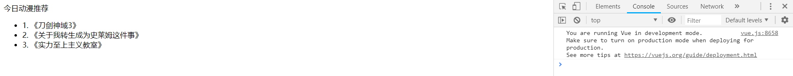
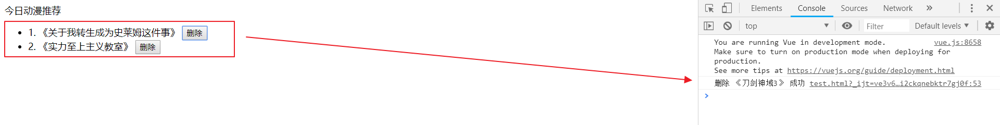

### Vue 中的内容分发

在 Vue.js 中我们使用 **<slot>** 元素作为承载分发内容的出口，作者称其为 **插槽**，可以应用在组合组件的场景中

### 利用插槽功能实现一个组合组件

比如准备制作一个待办事项组件（**todo**），该组件由待办标题（**todo-title**）和待办内容（**todo-items**）组成，但这三个组件又是相互独立的，该如何操作呢？

### 定义一个名为 ==todo== 的待办事项组件

```
Vue.component('todo', {
    template: '<div>\
                    <slot name="todo-title"></slot>\
                    <ul>\
                        <slot name="todo-items"></slot>\
                    </ul>\
               </div>'
});
```

该组件中放置了两个插槽，分别为 **todo-title** 和 **todo-items**

### 定义一个名为 ==todo-title== 的待办标题组件

```
Vue.component('todo-title', {
    props: ['title'],
    template: '<div>{{title}}</div>'
});
```

### 定义一个名为 ==todo-items== 的待办内容组件

```
Vue.component('todo-items', {
    props: ['item', 'index'],
    template: '<li>{{index + 1}}. {{item}}</li>'
});
```

### 实例化 Vue 并初始化数据

```
var vm = new Vue({
    el: '#vue',
    data: {
        todoItems: ['《刀剑神域3》', '《关于我转生成为史莱姆这件事》', '《实力至上主义教室》']
    }
});
```

### HTML

```
<div id="vue">
    <todo>
        <todo-title slot="todo-title" title="今日动漫推荐"></todo-title>
        <todo-items slot="todo-items" v-for="(item, index) in todoItems" v-bind:item="item" v-bind:index="index" :key="index"></todo-items>
    </todo>
</div>
```

此时，我们的 **todo-title** 和 **todo-items** 组件分别被分发到了 **todo** 组件的 **todo-title** 和 **todo-items** 插槽中

### 测试效果



### 使用自定义事件删除待办事项

通过以上代码不难发现，数据项在 Vue 的实例中，但删除操作要在组件中完成，那么组件如何才能删除 Vue 实例中的数据呢？此时就涉及到参数传递与事件分发了，Vue 为我们提供了自定义事件的功能很好的帮助我们解决了这个问题；使用 **this.$emit('自定义事件名', 参数)**，操作过程如下

### 修改创建 Vue 实例代码

```
var vm = new Vue({
    el: '#vue',
    data: {
        todoItems: ['《刀剑神域3》', '《关于我转生成为史莱姆这件事》', '《实力至上主义教室》']
    },
    methods: {
        // 该方法可以被模板中自定义事件触发
        removeTodoItems: function (index) {
            console.log("删除 " + this.todoItems[index] + " 成功");
            // splice() 方法向/从数组中添加/删除项目，然后返回被删除的项目，其中 index 为添加/删除项目的位置，1 表示删除的数量
            this.todoItems.splice(index, 1);
        }
    }
});
```

增加了 **methods** 对象并定义了一个名为 **removeTodoItems** 的方法

### 修改 ==todo-items== 待办内容组件的代码

```
Vue.component('todo-items', {
    props: ['item', 'index'],
    template: '<li>{{index + 1}}. {{item}} <button @click="remove">删除</button></li>',
    methods: {
        remove: function (index) {
            // 这里的 remove 是自定义事件的名称，需要在 HTML 中使用 v-on:remove 的方式指派
            this.$emit('remove', index);
        }
    }
});
```

增加了 **<button @click="remove">删除</button>** 元素并绑定了组件中定义的 **remove** 事件

### 修改 ==todo-items== 待办内容组件的 HTML 代码

```
<todo-items slot="todo-items" v-for="(item, index) in todoItems" v-bind:item="item" v-bind:index="index" :key="index" v-on:remove="removeTodoItems(index)"></todo-items>
```

增加了 **v-on:remove="removeTodoItems(index)"** 自定义事件，该事件会调用 Vue 实例中定义的名为 **removeTodoItems** 的方法

### 测试效果




### 完整的 HTML

```
<!DOCTYPE html>
<html>
<head>
    <meta charset="UTF-8">
    <title>布局篇 内容分发与自定义事件</title>
    <script src="https://cdn.jsdelivr.net/npm/vue"></script>
</head>
<body>

<div id="vue">
    <todo>
        <todo-title slot="todo-title" title="今日动漫推荐"></todo-title>
        <todo-items slot="todo-items" v-for="(item, index) in todoItems" v-bind:item="item" v-bind:index="index" :key="index" v-on:remove="removeTodoItems(index)"></todo-items>
    </todo>
</div>

<script type="text/javascript">
    // 定义一个待办事项组件
    Vue.component('todo', {
        template: '<div>\
                        <slot name="todo-title"></slot>\
                        <ul>\
                            <slot name="todo-items"></slot>\
                        </ul>\
                   </div>'
    });
    
    // 定义一个待办事项标题组件
    Vue.component('todo-title', {
        props: ['title'],
        template: '<div>{{title}}</div>'
    });
    
    // 定义一个待办事项内容组件
    Vue.component('todo-items', {
        props: ['item', 'index'],
        template: '<li>{{index + 1}}. {{item}} <button @click="remove">删除</button></li>',
        methods: {
            remove: function (index) {
                this.$emit('remove', index);
            }
        }
    });
    
    var vm = new Vue({
        el: '#vue',
        data: {
            todoItems: ['《刀剑神域3》', '《关于我转生成为史莱姆这件事》', '《实力至上主义教室》']
        },
        methods: {
            // 该方法可以被模板中自定义事件触发
            removeTodoItems: function (index) {
                console.log("删除 " + this.todoItems[index] + " 成功");
                this.todoItems.splice(index, 1);
            }
        }
    });
</script>
</body>
</html>
```
