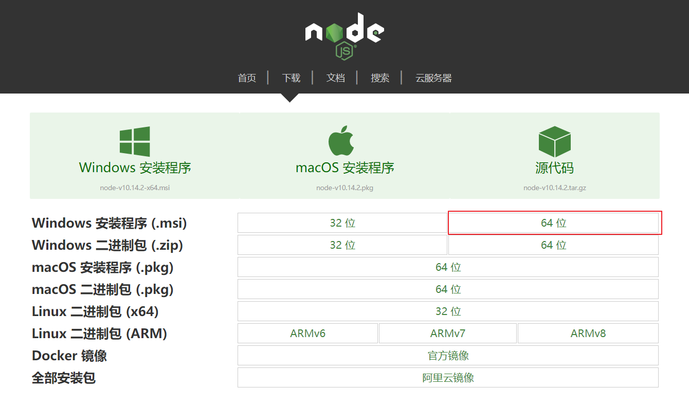

### 什么是 vue-cli

**vue-cli** 官方提供的一个脚手架（预先定义好的目录结构及基础代码，咱们在创建 Maven 项目时可以选择创建一个骨架项目，这个骨架项目就是脚手架）用于快速生成一个 vue 的项目模板

- 统一的目录结构

- 本地调试

- 热部署

- 单元测试

- 集成打包上线

---

# 安装

### 环境准备

- Node.js（>= 6.x，首选 8.x）

- git

### 安装 Node.js 

请自行前往 http://nodejs.cn/download 官网下载安装，此处不再赘述



### 安装 vue-cli

```
npm install vue-cli -g --registry=https://registry.npm.taobao.org

# 输出如下
npm WARN deprecated coffee-script@1.12.7: CoffeeScript on NPM has moved to "coffeescript" (no hyphen)
C:\Users\Administrator\AppData\Roaming\npm\vue -> C:\Users\Administrator\AppData\Roaming\npm\node_modules\vue-cli\bin\vue
C:\Users\Administrator\AppData\Roaming\npm\vue-init -> C:\Users\Administrator\AppData\Roaming\npm\node_modules\vue-cli\bin\vue-init
C:\Users\Administrator\AppData\Roaming\npm\vue-list -> C:\Users\Administrator\AppData\Roaming\npm\node_modules\vue-cli\bin\vue-list
+ vue-cli@2.9.6
added 241 packages from 206 contributors in 24.481s
```

### 测试是否安装成功

```
# 查看可以基于哪些模板创建 vue 应用程序，通常我们选择 webpack
vue list

# 输出如下
Available official templates:

★  browserify - A full-featured Browserify + vueify setup with hot-reload, linting & unit testing.
★  browserify-simple - A simple Browserify + vueify setup for quick prototyping.
★  pwa - PWA template for vue-cli based on the webpack template
★  simple - The simplest possible Vue setup in a single HTML file
★  webpack - A full-featured Webpack + vue-loader setup with hot reload, linting, testing & css extraction.
★  webpack-simple - A simple Webpack + vue-loader setup for quick prototyping.
```

### 第一个 vue-cli 应用程序

创建一个基于 webpack 模板的 vue 应用程序

```
# 这里的 hello-vue-cli 是项目名称，可以根据自己的需求起名
vue init webpack hello-vue-cli

# 输出如下
? Project name hello-vue-cli
? Project description A Vue.js project
? Author Lusifer <topsale@vip.qq.com>
? Vue build standalone
? Install vue-router? No
? Use ESLint to lint your code? No
? Set up unit tests No
? Setup e2e tests with Nightwatch? No
? Should we run `npm install` for you after the project has been created? (recommended) no

   vue-cli · Generated "hello-vue-cli".

# Project initialization finished!
# ========================

To get started:

  cd hello-vue-cli
  npm install (or if using yarn: yarn)
  npm run dev
  
Documentation can be found at https://vuejs-templates.github.io/webpack
```

**说明**

- **Project name**：项目名称，默认 **回车** 即可

- **Project description**：项目描述，默认 **回车** 即可

- **Author**：项目作者，默认 **回车** 即可

- **Install vue-router**：是否安装 **vue-router**，选择 **n** 不安装（后期需要再手动添加）

- **Use ESLint to lint your code**：是否使用 **ESLint** 做代码检查，选择 **n** 不安装（后期需要再手动添加）

- **Set up unit tests**：单元测试相关，选择 **n** 不安装（后期需要再手动添加）

- **Setup e2e tests with Nightwatch**：单元测试相关，选择 **n** 不安装（后期需要再手动添加）

- **Should we run npm install for you after the project has been created**：创建完成后直接初始化，选择 **n**，我们手动执行

### 初始化并运行

```
# 初始化
cd hello-vue-cli
npm install --registry=https://registry.npm.taobao.org

# 输出如下
npm WARN deprecated browserslist@2.11.3: Browserslist 2 could fail on reading Browserslist >3.0 config used in other tools.
npm WARN deprecated bfj-node4@5.3.1: Switch to the `bfj` package for fixes and new features!
npm WARN deprecated browserslist@1.7.7: Browserslist 2 could fail on reading Browserslist >3.0 config used in other tools.

> core-js@2.6.9 postinstall D:\Workspace\Study\other\hello-vue-cli\node_modules\core-js
> node scripts/postinstall || echo "ignore"

Thank you for using core-js ( https://github.com/zloirock/core-js ) for polyfilling JavaScript standard library!

The project needs your help! Please consider supporting of core-js on Open Collective or Patreon:
> https://opencollective.com/core-js
> https://www.patreon.com/zloirock

Also, the author of core-js ( https://github.com/zloirock ) is looking for a good job -)

> uglifyjs-webpack-plugin@0.4.6 postinstall D:\Workspace\Study\other\hello-vue-cli\node_modules\webpack\node_modules\uglifyjs-webpack-plugin
> node lib/post_install.js

npm notice created a lockfile as package-lock.json. You should commit this file.
npm WARN ajv-keywords@3.4.1 requires a peer of ajv@^6.9.1 but none is installed. You must install peer dependencies yourself.
npm WARN optional SKIPPING OPTIONAL DEPENDENCY: fsevents@1.2.9 (node_modules\fsevents):
npm WARN notsup SKIPPING OPTIONAL DEPENDENCY: Unsupported platform for fsevents@1.2.9: wanted {"os":"darwin","arch":"any"} (current: {"os":"win32","arch":"x64"})

added 1207 packages from 667 contributors and audited 11765 packages in 81.571s
found 10 vulnerabilities (6 moderate, 4 high)
  run `npm audit fix` to fix them, or `npm audit` for details
  
# 运行
npm run dev

# 输出如下
 DONE  Compiled successfully in 3226ms                                   
 I  Your application is running here: http://localhost:8080
```

安装并运行成功后在浏览器输入：http://localhost:8080


### 目录结构

- **build** 和 **config**：WebPack 配置文件

- **node_modules**：用于存放 **npm install** 安装的依赖文件

- **src**：项目源码目录

- **static**：静态资源文件

- **.babelrc**：Babel 配置文件，主要作用是将 ES6 转换为 ES5

- **.editorconfig**：编辑器配置

- **eslintignore**：需要忽略的语法检查配置文件

- **.gitignore**：git 忽略的配置文件

- **.postcssrc.js**：css 相关配置文件，其中内部的 **module.exports** 是 NodeJS 模块化语法

- **index.html**：首页，仅作为模板页，实际开发时不使用

- **package.json**：项目的配置文件

    - **name**：项目名称
    
    - **version**：项目版本
    
    - **description**：项目描述
    
    - **author**：项目作者
    
    - **scripts**：封装常用命令
    
    - **dependencies**：生产环境依赖
    
    - **devDependencies**：开发环境依赖

### 源码目录

```
│  App.vue
│  main.js
│
├─assets
│      logo.png
│
└─components
        HelloWorld.vue
```

### main.js

项目的入口文件，我们知道所有的程序都会有一个入口

```
// The Vue build version to load with the `import` command
// (runtime-only or standalone) has been set in webpack.base.conf with an alias.
import Vue from 'vue'
import App from './App'

Vue.config.productionTip = false

/* eslint-disable no-new */
new Vue({
  el: '#app',
  components: { App },
  template: '<App/>'
})
```

- **import Vue from 'vue'**：ES6 写法，会被转换成 **require("vue")**; （require 是 NodeJS 提供的模块加载器）

- **import App from './App'**：意思同上，但是指定了查找路径，**./** 为当前目录

- **Vue.config.productionTip = false**：关闭浏览器控制台关于环境的相关提示

- **new Vue({...})**：实例化 Vue

    - **el: '#app'**：查找 index.html 中 id 为 app 的元素
    
    - **template: '<App/>'**：模板，会将 index.html 中 **<div id="app"></div>** 替换为 **<App />**
    
    - **components: { App }**：引入组件，使用的是 **import App from './App'** 定义的 App 组件

### App.vue

组件模板

```
<template>
  <div id="app">
    
    <HelloWorld/>
  </div>
</template>

<script>
import HelloWorld from './components/HelloWorld'

export default {
  name: 'App',
  components: {
    HelloWorld
  }
}
</script>

<style>
#app {
  <!-- 字体 -->
  font-family: 'Avenir', Helvetica, Arial, sans-serif;
  <!-- 文字平滑效果 -->
  -webkit-font-smoothing: antialiased;
  -moz-osx-font-smoothing: grayscale;
  text-align: center;
  color: #2c3e50;
  margin-top: 60px;
}
</style>
```

- **template**：HTML 代码模板，会替换 **<App />** 中的内容

- **import HelloWorld from './components/HelloWorld'**：引入 HelloWorld 组件，用于替换 **template** 中的 **<HelloWorld/>**

- **export default{...}**：导出 NodeJS 对象，作用是可以通过 **import** 关键字导入

    - **name: 'App'**：定义组件的名称
    
    - **components: { HelloWorld }**：定义子组件

### HelloWorld.vue

基本同上，不解释..

关于 **<style scoped>** 的说明：CSS 样式仅在当前组件有效，声明了样式的作用域
