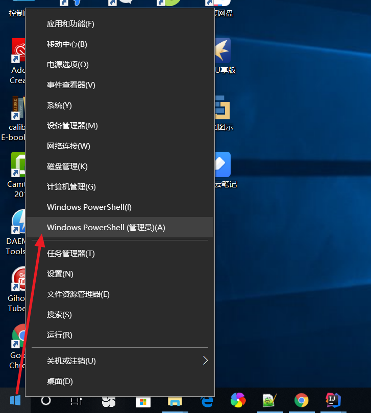
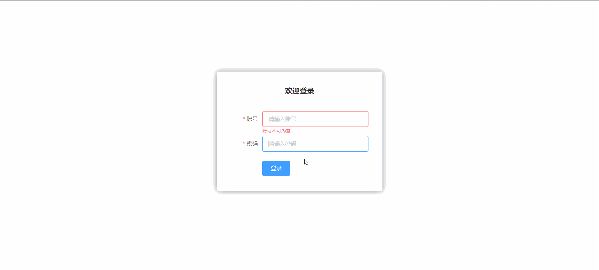

### 概述

我们结合 [ElementUI](https://element.eleme.cn/#/zh-CN) 组件库，将所需知识点应用到实际中，以最快速度带领大家掌握 Vue 的使用

### 创建工程

> **注意**： 使用 NPM 安装相关组件依赖时可能会遇到权限问题，此时使用 PowerShell 管理员模式运行即可；开始菜单 -> 鼠标右击 -> Windows PowerShell (管理员)



创建一个名为 **hello-vue-element** 的工程

```
# 使用 webpack 打包工具初始化一个名为 hello-vue-element 的工程
vue init webpack hello-vue-element
```

### 安装依赖

我们需要安装 **vue-router**、**element-ui**、**sass-loader** 和 **node-sass** 四个插件

```
# 进入工程目录
cd hello-vue-element

# 安装 vue-router
npm install vue-router --save-dev --registry=https://registry.npm.taobao.org

# 安装 element-ui
npm i element-ui -S --registry=https://registry.npm.taobao.org

# 安装 SASS 加载器
npm install sass-loader node-sass --save-dev --registry=https://registry.npm.taobao.org
```

```
# 安装依赖
npm install --registry=https://registry.npm.taobao.org
```

### 启动项目

```
npm run dev
```

### 运行项目

在浏览器打开 http://localhost:8080

### 第一个 ElementUI 页面

#### 目录结构

在源码目录中创建如下结构：

- **assets**：用于存放资源文件

- **components**：用于存放 Vue 功能组件

- **views**：用于存放 Vue 视图组件

- **router**：用于存放 vue-router 配置

#### 创建首页视图

在 **views** 目录下创建一个名为 **Main.vue** 的视图组件；该组件在当前章节无任何作用，主要用于登录后展示登录成功的跳转效果；

```
<template>
    <div>
      首页
    </div>
</template>

<script>
    export default {
        name: "Main"
    }
</script>

<style scoped>
</style>
```

#### 创建登录页视图

在 **views** 目录下创建一个名为 **Login.vue** 的视图组件，其中 **el-*** 的元素为 ElementUI 组件；

```
<template>
  <div>
    <el-form ref="loginForm" :model="form" :rules="rules" label-width="80px" class="login-box">
      <h3 class="login-title">欢迎登录</h3>
      <el-form-item label="账号" prop="username">
        <el-input type="text" placeholder="请输入账号" v-model="form.username"/>
      </el-form-item>
      <el-form-item label="密码" prop="password">
        <el-input type="password" placeholder="请输入密码" v-model="form.password"/>
      </el-form-item>
      <el-form-item>
        <el-button type="primary" v-on:click="onSubmit('loginForm')">登录</el-button>
      </el-form-item>
    </el-form>
    
    <el-dialog
      title="温馨提示"
      :visible.sync="dialogVisible"
      width="30%"
      :before-close="handleClose">
      <span>请输入账号和密码</span>
      <span slot="footer" class="dialog-footer">
        <el-button type="primary" @click="dialogVisible = false">确 定</el-button>
      </span>
    </el-dialog>
  </div>
</template>    
    
<script>
  export default {
    name: "Login",
    data() {
      return {
        form: {
          username: '',
          password: ''
        },
        
        // 表单验证，需要在 el-form-item 元素中增加 prop 属性
        rules: {
          username: [
            {required: true, message: '账号不可为空', trigger: 'blur'}
          ],
          password: [
            {required: true, message: '密码不可为空', trigger: 'blur'}
          ]
        },        

        // 对话框显示和隐藏
        dialogVisible: false
      }
    },
    methods: {
      onSubmit(formName) {
        // 为表单绑定验证功能
        this.$refs[formName].validate((valid) => {
          if (valid) {
            // 使用 vue-router 路由到指定页面，该方式称之为编程式导航
            this.$router.push("/main");
          } else {
            this.dialogVisible = true;
            return false;
          }
        });
      }
    }
  }
</script>

<style lang="scss" scoped>
  .login-box {
    border: 1px solid #DCDFE6;
    width: 350px;
    margin: 180px auto;
    padding: 35px 35px 15px 35px;
    border-radius: 5px;
    -webkit-border-radius: 5px;
    -moz-border-radius: 5px;
    box-shadow: 0 0 25px #909399;
  }
  
  .login-title {
    text-align: center;
    margin: 0 auto 40px auto;
    color: #303133;
  }
</style>
```

#### 创建路由

在 **router** 目录下创建一个名为 **index.js** 的 vue-router 路由配置文件

```
import Vue from 'vue'
import Router from 'vue-router'

import Login from "../views/Login"
import Main from '../views/Main'

Vue.use(Router);

export default new Router({
  routes: [
    {
      // 登录页
      path: '/login',
      name: 'Login',
      component: Login
    },
    {
      // 首页
      path: '/main',
      name: 'Main',
      component: Main
    }
  ]
});
```

#### 配置路由

- 修改** main.js** 入口代码

```
import Vue from 'vue'
import VueRouter from 'vue-router'
import router from './router'

// 导入 ElementUI
import ElementUI from 'element-ui'
import 'element-ui/lib/theme-chalk/index.css'

import App from './App'

// 安装路由
Vue.use(VueRouter);

// 安装 ElementUI
Vue.use(ElementUI);

new Vue({
  el: '#app',
  // 启用路由
  router,
  // 启用 ElementUI
  render: h => h(App)
});
```

- 修改 **App.vue** 组件代码

```
<template>
  <div id="app">
    <router-view/>
  </div>
</template>

<script>
  export default {
    name: 'App',
  }
</script>
```

#### 效果演示

在浏览器打开 http://localhost:8080/#/login 你会看到如下效果



### 附：扩展阅读

#### NPM 相关命令说明

- **npm install moduleName**：安装模块到项目目录下

- **npm install -g moduleName**：**-g** 的意思是将模块安装到全局，具体安装到磁盘哪个位置，要看 npm config prefix 的位置

- **npm install -save moduleName**：**--save** 的意思是将模块安装到项目目录下，并在 package 文件的 dependencies 节点写入依赖，-S 为该命令的缩写

- **npm install -save-dev moduleName**：**--save-dev** 的意思是将模块安装到项目目录下，并在 package 文件的 devDependencies 节点写入依赖，-D 为该命令的缩写
