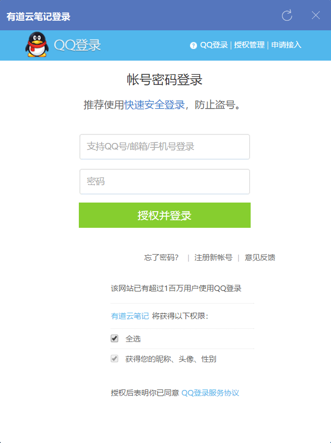

### 交互模型

交互模型涉及三方：

- 资源拥有者：用户

- 客户端：APP

- 服务提供方：包含两个角色

    - 认证服务器
    
    - 资源服务器

### 认证服务器

认证服务器负责对用户进行认证，并授权给客户端权限。认证很容易实现（验证账号密码即可），问题在于如何授权。比如我们使用第三方登录 "有道云笔记"，你可以看到如使用 QQ 登录的授权页面上有 "有道云笔记将获得以下权限" 的字样以及权限信息



认证服务器需要知道请求授权的客户端的身份以及该客户端请求的权限。我们可以为每一个客户端预先分配一个 id，并给每个 id 对应一个名称以及权限信息。这些信息可以写在认证服务器上的配置文件里。然后，客户端每次打开授权页面的时候，把属于自己的 id 传过来，如：

```
http://www.funtl.com/login?client_id=yourClientId
```

随着时间的推移和业务的增长，会发现，修改配置的工作消耗了太多的人力。有没有办法把这个过程自动化起来，把人工从这些繁琐的操作中解放出来？当开始考虑这一步，开放平台的成型也就是水到渠成的事情了。

### oAuth2 开放平台

开放平台是由 oAuth2.0 协议衍生出来的一个产品。它的作用是让客户端自己去这上面进行注册、申请，通过之后系统自动分配 client_id ，并完成配置的自动更新（通常是写进数据库）。

客户端要完成申请，通常需要填写客户端程序的类型（Web、App 等）、企业介绍、执照、想要获取的权限等等信息。这些信息在得到服务提供方的人工审核通过后，开发平台就会自动分配一个 client_id 给客户端了。

到这里，已经实现了登录认证、授权页的信息展示。那么接下来，当用户成功进行授权之后，认证服务器需要把产生的 access_token 发送给客户端，方案如下：

- 让客户端在开放平台申请的时候，填写一个 URL，例如：http://www.funtl.com

- 每次当有用户授权成功之后，认证服务器将页面重定向到这个 URL（回调），并带上 access_token，例如：http://www.funtl.com?access_token=123456789

- 客户端接收到了这个 access_token，而且认证服务器的授权动作已经完成，刚好可以把程序的控制权转交回客户端，由客户端决定接下来向用户展示什么内容
