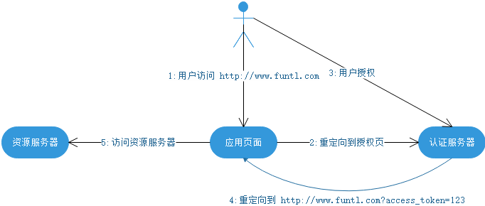
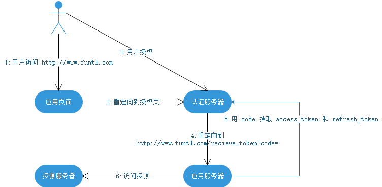
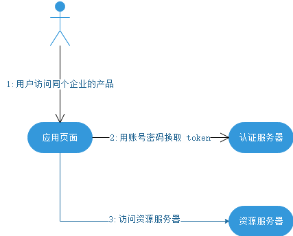
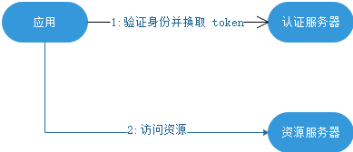

### 概述

客户端必须得到用户的授权（authorization grant），才能获得令牌（access token）。oAuth 2.0 定义了四种授权方式。

- implicit：简化模式，不推荐使用

- authorization code：授权码模式

- resource owner password credentials：密码模式

- client credentials：客户端模式

### 简化模式 

简化模式适用于纯静态页面应用。所谓纯静态页面应用，也就是应用没有在服务器上执行代码的权限（通常是把代码托管在别人的服务器上），只有前端 JS 代码的控制权。

这种场景下，应用是没有持久化存储的能力的。因此，按照 oAuth2.0 的规定，这种应用是拿不到 Refresh Token 的。其整个授权流程如下：



该模式下，access_token 容易泄露且不可刷新

### 授权码模式

授权码模式适用于有自己的服务器的应用，它是一个一次性的临时凭证，用来换取 access_token 和 refresh_token。认证服务器提供了一个类似这样的接口：

```
https://www.funtl.com/exchange?code=&client_id=&client_secret=
```

需要传入 code、client_id 以及 client_secret。验证通过后，返回 access_token 和 refresh_token。一旦换取成功，code 立即作废，不能再使用第二次。流程图如下：



这个 code 的作用是保护 token 的安全性。上一节说到，简单模式下，token 是不安全的。这是因为在第 4 步当中直接把 token 返回给应用。而这一步容易被拦截、窃听。引入了 code 之后，即使攻击者能够窃取到 code，但是由于他无法获得应用保存在服务器的 client_secret，因此也无法通过 code 换取 token。而第 5 步，为什么不容易被拦截、窃听呢？这是因为，首先，这是一个从服务器到服务器的访问，黑客比较难捕捉到；其次，这个请求通常要求是 https 的实现。即使能窃听到数据包也无法解析出内容。

有了这个 code，token 的安全性大大提高。因此，oAuth2.0 鼓励使用这种方式进行授权，而简单模式则是在不得已情况下才会使用。

### 密码模式

密码模式中，用户向客户端提供自己的用户名和密码。客户端使用这些信息，向 "服务商提供商" 索要授权。在这种模式中，用户必须把自己的密码给客户端，但是客户端不得储存密码。这通常用在用户对客户端高度信任的情况下，比如客户端是操作系统的一部分。

一个典型的例子是同一个企业内部的不同产品要使用本企业的 oAuth2.0 体系。在有些情况下，产品希望能够定制化授权页面。由于是同个企业，不需要向用户展示“xxx将获取以下权限”等字样并询问用户的授权意向，而只需进行用户的身份认证即可。这个时候，由具体的产品团队开发定制化的授权界面，接收用户输入账号密码，并直接传递给鉴权服务器进行授权即可。



有一点需要特别注意的是，在第 2 步中，认证服务器需要对客户端的身份进行验证，确保是受信任的客户端。

### 客户端模式

如果信任关系再进一步，或者调用者是一个后端的模块，没有用户界面的时候，可以使用客户端模式。鉴权服务器直接对客户端进行身份验证，验证通过后，返回 token。


