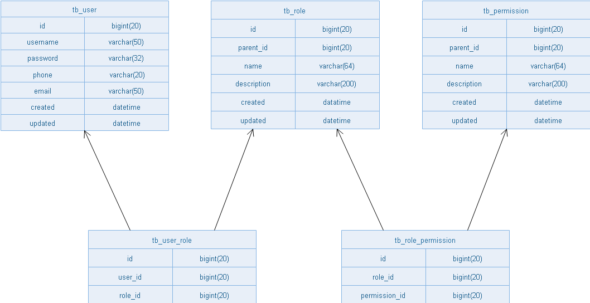
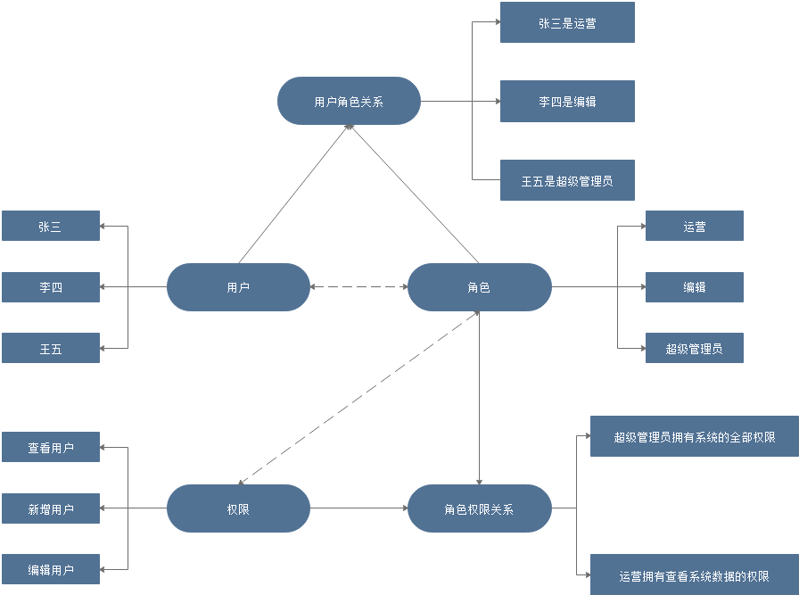
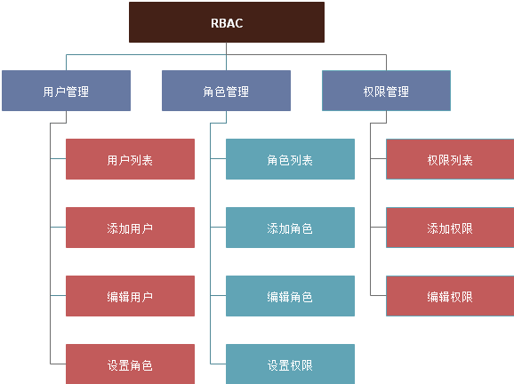

### 概述

RBAC（Role-Based Access Control，基于角色的访问控制），就是用户通过角色与权限进行关联。简单地说，一个用户拥有若干角色，每一个角色拥有若干权限。这样，就构造成“用户-角色-权限”的授权模型。在这种模型中，用户与角色之间，角色与权限之间，一般是多对多的关系。（如下图）



### 目的

在我们的 oAuth2 系统中，我们需要对系统的所有资源进行权限控制，系统中的资源包括：

- 静态资源（对象资源）：功能操作、数据列

- 动态资源（数据资源）：数据

系统的目的就是对应用系统的所有对象资源和数据资源进行权限控制，比如：功能菜单、界面按钮、数据显示的列、各种行级数据进行权限的操控

# 对象关系

### 权限

系统的所有权限信息。权限具有上下级关系，是一个树状的结构。如：

- 系统管理

    - 用户管理

        - 查看用户
        
        - 新增用户
        
        - 修改用户
        
        - 删除用户

### 用户

系统的具体操作者，可以归属于一个或多个角色，它与角色的关系是多对多的关系

### 角色

为了对许多拥有相似权限的用户进行分类管理，定义了角色的概念，例如系统管理员、管理员、用户、访客等角色。角色具有上下级关系，可以形成树状视图，父级角色的权限是自身及它的所有子角色的权限的综合。父级角色的用户、父级角色的组同理可推。

### 关系图



### 模块图



### 表结构

```
CREATE TABLE `tb_permission` (
  `id` bigint(20) NOT NULL AUTO_INCREMENT,
  `parent_id` bigint(20) DEFAULT NULL COMMENT '父权限',
  `name` varchar(64) NOT NULL COMMENT '权限名称',
  `enname` varchar(64) NOT NULL COMMENT '权限英文名称',
  `url` varchar(255) NOT NULL COMMENT '授权路径',
  `description` varchar(200) DEFAULT NULL COMMENT '备注',
  `created` datetime NOT NULL,
  `updated` datetime NOT NULL,
  PRIMARY KEY (`id`)
) ENGINE=InnoDB AUTO_INCREMENT=37 DEFAULT CHARSET=utf8 COMMENT='权限表';

CREATE TABLE `tb_role` (
  `id` bigint(20) NOT NULL AUTO_INCREMENT,
  `parent_id` bigint(20) DEFAULT NULL COMMENT '父角色',
  `name` varchar(64) NOT NULL COMMENT '角色名称',
  `enname` varchar(64) NOT NULL COMMENT '角色英文名称',
  `description` varchar(200) DEFAULT NULL COMMENT '备注',
  `created` datetime NOT NULL,
  `updated` datetime NOT NULL,
  PRIMARY KEY (`id`)
) ENGINE=InnoDB AUTO_INCREMENT=37 DEFAULT CHARSET=utf8 COMMENT='角色表';

CREATE TABLE `tb_role_permission` (
  `id` bigint(20) NOT NULL AUTO_INCREMENT,
  `role_id` bigint(20) NOT NULL COMMENT '角色 ID',
  `permission_id` bigint(20) NOT NULL COMMENT '权限 ID',
  PRIMARY KEY (`id`)
) ENGINE=InnoDB AUTO_INCREMENT=37 DEFAULT CHARSET=utf8 COMMENT='角色权限表';

CREATE TABLE `tb_user` (
  `id` bigint(20) NOT NULL AUTO_INCREMENT,
  `username` varchar(50) NOT NULL COMMENT '用户名',
  `password` varchar(64) NOT NULL COMMENT '密码，加密存储',
  `phone` varchar(20) DEFAULT NULL COMMENT '注册手机号',
  `email` varchar(50) DEFAULT NULL COMMENT '注册邮箱',
  `created` datetime NOT NULL,
  `updated` datetime NOT NULL,
  PRIMARY KEY (`id`),
  UNIQUE KEY `username` (`username`) USING BTREE,
  UNIQUE KEY `phone` (`phone`) USING BTREE,
  UNIQUE KEY `email` (`email`) USING BTREE
) ENGINE=InnoDB AUTO_INCREMENT=37 DEFAULT CHARSET=utf8 COMMENT='用户表';

CREATE TABLE `tb_user_role` (
  `id` bigint(20) NOT NULL AUTO_INCREMENT,
  `user_id` bigint(20) NOT NULL COMMENT '用户 ID',
  `role_id` bigint(20) NOT NULL COMMENT '角色 ID',
  PRIMARY KEY (`id`)
) ENGINE=InnoDB AUTO_INCREMENT=37 DEFAULT CHARSET=utf8 COMMENT='用户角色表';
```
