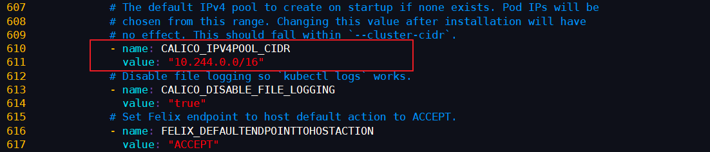

### 概述

容器网络是容器选择连接到其他容器、主机和外部网络的机制。容器的 runtime 提供了各种网络模式，每种模式都会产生不同的体验。例如，Docker 默认情况下可以为容器配置以下网络：

- **none**： 将容器添加到一个容器专门的网络堆栈中，没有对外连接。

- **host**： 将容器添加到主机的网络堆栈中，没有隔离。

- **default bridge**： 默认网络模式。每个容器可以通过 IP 地址相互连接。

- **自定义网桥**： 用户定义的网桥，具有更多的灵活性、隔离性和其他便利功能。

### 什么是 CNI

CNI(Container Network Interface) 是一个标准的，通用的接口。在容器平台，Docker，Kubernetes，Mesos 容器网络解决方案 flannel，calico，weave。只要提供一个标准的接口，就能为同样满足该协议的所有容器平台提供网络功能，而 CNI 正是这样的一个标准接口协议。

### Kubernetes 中的 CNI 插件

CNI 的初衷是创建一个框架，用于在配置或销毁容器时动态配置适当的网络配置和资源。插件负责为接口配置和管理 IP 地址，并且通常提供与 IP 管理、每个容器的 IP 分配、以及多主机连接相关的功能。容器运行时会调用网络插件，从而在容器启动时分配 IP 地址并配置网络，并在删除容器时再次调用它以清理这些资源。

运行时或协调器决定了容器应该加入哪个网络以及它需要调用哪个插件。然后，插件会将接口添加到容器网络命名空间中，作为一个 veth 对的一侧。接着，它会在主机上进行更改，包括将 veth 的其他部分连接到网桥。再之后，它会通过调用单独的 IPAM（IP地址管理）插件来分配 IP 地址并设置路由。

在 Kubernetes 中，kubelet 可以在适当的时间调用它找到的插件，为通过 kubelet 启动的 pod进行自动的网络配置。

Kubernetes 中可选的 CNI 插件如下：

- Flannel

- Calico

- Canal

- Weave

### 什么是 Calico

Calico 为容器和虚拟机提供了安全的网络连接解决方案，并经过了大规模生产验证（在公有云和跨数千个集群节点中），可与 Kubernetes，OpenShift，Docker，Mesos，DC / OS 和 OpenStack 集成。

Calico 还提供网络安全规则的动态实施。使用 Calico 的简单策略语言，您可以实现对容器，虚拟机工作负载和裸机主机端点之间通信的细粒度控制。

### 下载 Calico 配置文件并修改

```
wget https://docs.projectcalico.org/v3.8/manifests/calico.yaml
```

```
vi calico.yaml
```

修改第 611 行，将 **192.168.0.0/16** 修改为 **10.244.0.0/16**，可以通过如下命令快速查找

- 显示行号：**:set number**

- 查找字符：**/要查找的字符**，输入小写 **n** 下一个匹配项，输入大写 **N** 上一个匹配项



### 安装网络插件 Calico

> 注意： 截止到文章发表日期 2019 年 07 月 20 日，Calico 官方版本为 3.8

参考官方文档安装：https://docs.projectcalico.org/v3.8/getting-started/kubernetes/

```
kubectl apply -f calico.yaml

# 输出如下
configmap/calico-config created
customresourcedefinition.apiextensions.k8s.io/felixconfigurations.crd.projectcalico.org created
customresourcedefinition.apiextensions.k8s.io/ipamblocks.crd.projectcalico.org created
customresourcedefinition.apiextensions.k8s.io/blockaffinities.crd.projectcalico.org created
customresourcedefinition.apiextensions.k8s.io/ipamhandles.crd.projectcalico.org created
customresourcedefinition.apiextensions.k8s.io/ipamconfigs.crd.projectcalico.org created
customresourcedefinition.apiextensions.k8s.io/bgppeers.crd.projectcalico.org created
customresourcedefinition.apiextensions.k8s.io/bgpconfigurations.crd.projectcalico.org created
customresourcedefinition.apiextensions.k8s.io/ippools.crd.projectcalico.org created
customresourcedefinition.apiextensions.k8s.io/hostendpoints.crd.projectcalico.org created
customresourcedefinition.apiextensions.k8s.io/clusterinformations.crd.projectcalico.org created
customresourcedefinition.apiextensions.k8s.io/globalnetworkpolicies.crd.projectcalico.org created
customresourcedefinition.apiextensions.k8s.io/globalnetworksets.crd.projectcalico.org created
customresourcedefinition.apiextensions.k8s.io/networkpolicies.crd.projectcalico.org created
customresourcedefinition.apiextensions.k8s.io/networksets.crd.projectcalico.org created
clusterrole.rbac.authorization.k8s.io/calico-kube-controllers created
clusterrolebinding.rbac.authorization.k8s.io/calico-kube-controllers created
clusterrole.rbac.authorization.k8s.io/calico-node created
clusterrolebinding.rbac.authorization.k8s.io/calico-node created
daemonset.extensions/calico-node created
serviceaccount/calico-node created
deployment.extensions/calico-kube-controllers created
serviceaccount/calico-kube-controllers created
```

### 验证安装是否成功

- 查看 Calico 网络插件处于 **Running** 状态即表示安装成功

```
watch kubectl get pods --all-namespaces

# 输出如下
NAMESPACE     NAME                                        READY   STATUS    RESTARTS   AGE
kube-system   calico-kube-controllers-658558ddf8-9zzjg    1/1     Running   0          90s
kube-system   calico-node-9cr5f                           1/1     Running   0          91s
kube-system   calico-node-n99mz                           1/1     Running   0          91s
kube-system   calico-node-nl67v                           1/1     Running   0          91s
kube-system   coredns-bccdc95cf-9s4bm                     1/1     Running   0          56m
kube-system   coredns-bccdc95cf-s8ggd                     1/1     Running   0          56m
kube-system   etcd-kubernetes-master                      1/1     Running   0          55m
kube-system   kube-apiserver-kubernetes-master            1/1     Running   0          55m
kube-system   kube-controller-manager-kubernetes-master   1/1     Running   0          55m
kube-system   kube-proxy-8s87d                            1/1     Running   0          36m
kube-system   kube-proxy-cbnlb                            1/1     Running   0          36m
kube-system   kube-proxy-vwhxj                            1/1     Running   0          56m
kube-system   kube-scheduler-kubernetes-master            1/1     Running   0          55m
```

- 查看节点状态处于 **Ready** 即表示安装成功

```
kubectl get node

# 输出如下
NAME                 STATUS   ROLES    AGE   VERSION
kubernetes-master    Ready    master   57m   v1.15.0
kubernetes-node-01   Ready    <none>   37m   v1.15.0
kubernetes-node-02   Ready    <none>   36m   v1.15.0
```
