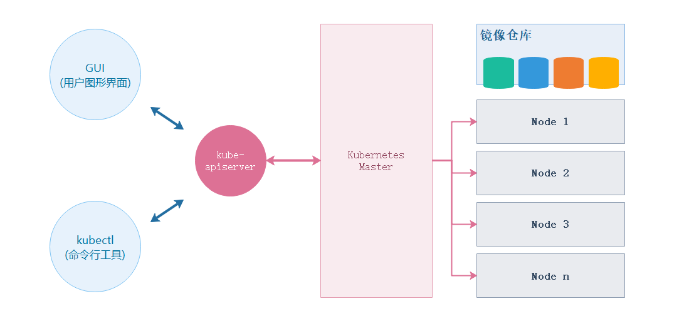
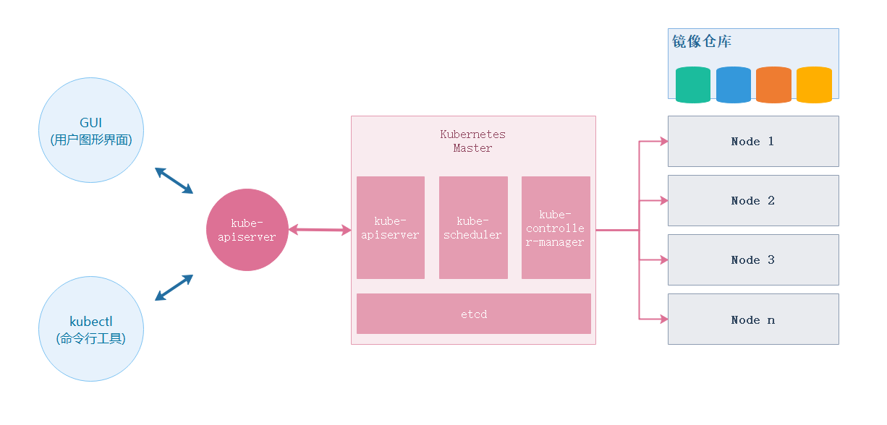
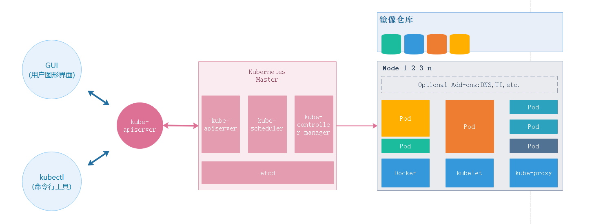
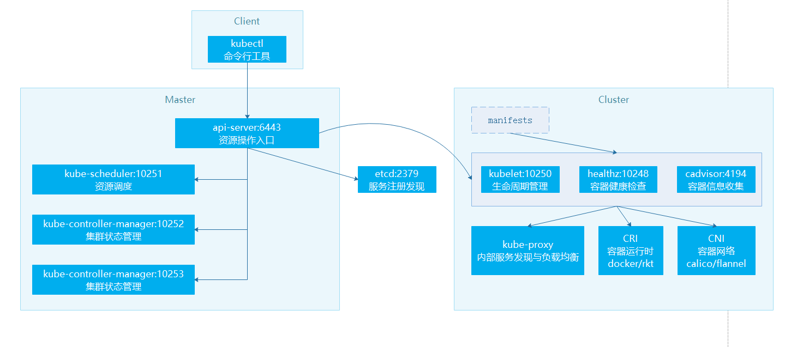
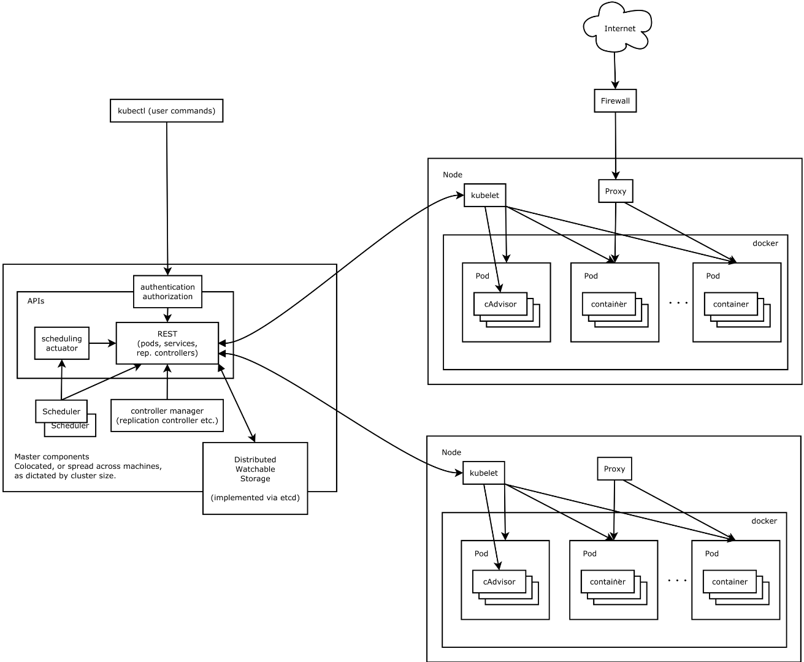

### 什么是 Kubernetes

Kubernetes 是一个开源的 Docker 容器编排系统，它可以调度计算集群的节点，动态管理上面的作业，保证它们按用户期望的状态运行。通过使用「labels」和「pods」的概念，Kubernetes 将应用按逻辑单元进行分组，方便管理和服务发现。

- **pods**： 是一组紧密关联的容器集合，它们共享 IPC(进程间通信)、Network(网络) 和 UTS namespace(UTS 命名空间是 Linux 命名空间的一个子系统，主要作用是完成对容器 Hostname 和 Domain 的隔离，同时保存内核名称、版本、以及底层体系结构类型等信息)，是 Kubernetes 调度的基本单位。

- **labels**： 键值对(key/value)标签，可以被关联到如 Pod 这样的对象上，主要作用是给用户一个直观的感受，比如这个 Pod 是用来放置数据库的

- **GUI**： 用户图形界面，可以是 Web 用户界面，比如使用 **kubernetes-dashboard** 组件，用户可以通过 Dashboard 在 Kubernetes 集群中部署容器化的应用，可以查看集群中应用的运行情况，同时也能够基于 Dashboard 创建或修改部署、任务、服务等 Kubernetes 的资源。通过部署向导，用户能够对部署进行扩缩容，进行滚动更新、重启 Pod 和部署新应用。当然，通过 Dashboard 也能够查看 Kubernetes 资源的状态

- **kubectl**： 用于管理 Kubernetes 集群的命令行工具

- **kube-apiserver**： 提供了资源操作的唯一入口，并提供认证、授权、访问控制、API 注册和发现等机制

- **Kubernetes Master**： Kubernetes 集群主节点，主要由 **kube-apiserver、kube-scheduler、kube-controller-manager、etcd** 四个模块组成

- **Kubernetes Node**： Kubernetes 集群子节点，主要由 **kubelet、kube-proxy、runtime** 三个模块组成

- **Image Registry**： 镜像仓库，比如：Ducker HUB 或 Docker 私服

### Kubernetes Master

- **kube-apiserver**： 提供了资源操作的唯一入口，并提供认证、授权、访问控制、API 注册和发现等机制

- **kube-scheduler**： 负责资源的调度，按照预定的调度策略将 Pod 调度到相应的机器上

- **kube-controller-manager**： 负责维护集群的状态，比如故障检测、自动扩展、滚动更新等

- **etcd**： CoreOS 基于 Raft 开发的分布式 key-value 存储，可用于服务发现、共享配置以及一致性保障（如数据库选主、分布式锁等）

### Kubernetes Node

- **runtime**： 负责镜像管理以及 Pod 和容器的真正运行（CRI，Container Runtime Interface），默认的容器运行时为 Docker，还支持 RKT 容器

- **kubelet**： 负责维持容器的生命周期，同时也负责 Volume（CVI，Container Volume Interface）和网络（CNI，Container Network Interface）的管理

- **kube-proxy**： 负责为 Service 提供 cluster 内部的服务发现和负载均衡

### Kubernetes 架构

