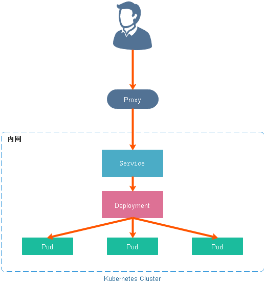
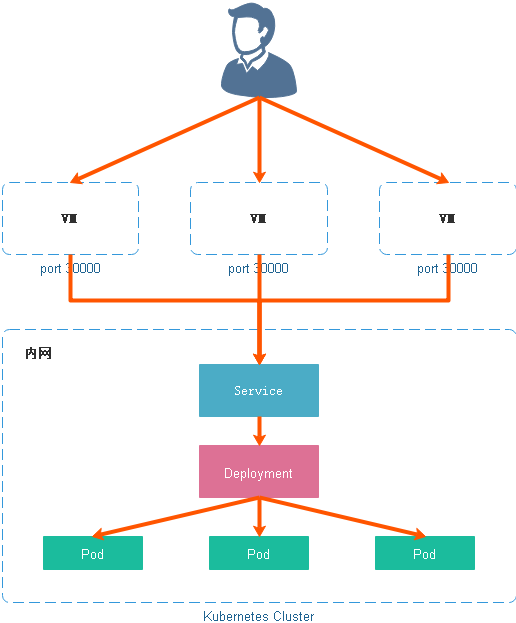
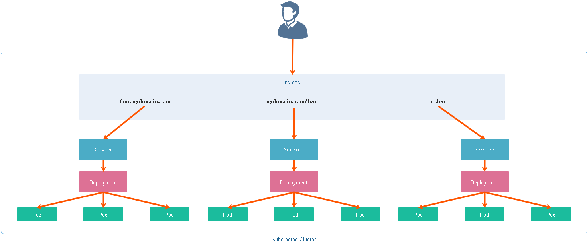

### 术语

- **节点**： Kubernetes 集群中的服务器

- **集群**： Kubernetes 管理的一组服务器集合

- **边界路由器**： 为局域网和 Internet 路由数据包的路由器，执行防火墙保护局域网络

- **集群网络**： 遵循 Kubernetes 网络模型实现集群内的通信的具体实现，比如 Flannel 和 Calico

- **服务**： Kubernetes 的服务 (Service) 是使用标签选择器标识的一组 Pod Service (Deployment)。 除非另有说明，否则服务的虚拟 IP 仅可在集群内部访问

### 内部访问方式 ClusterIP

ClusterIP 服务是 Kubernetes 的默认服务。它给你一个集群内的服务，集群内的其它应用都可以访问该服务。集群外部无法访问它。在某些场景下我们可以使用 Kubernetes 的 Proxy 模式来访问服务，比如调试服务时。

# 三种外部访问方式

### NodePort

NodePort 服务是引导外部流量到你的服务的最原始方式。NodePort，正如这个名字所示，在所有节点（虚拟机）上开放一个特定端口，任何发送到该端口的流量都被转发到对应服务。

NodePort 服务特征如下：

- 每个端口只能是一种服务

- 端口范围只能是 30000-32767（可调）

- 不在 YAML 配置文件中指定则会分配一个默认端口

> 建议： 不要在生产环境中使用这种方式暴露服务，大多数时候我们应该让 Kubernetes 来选择端口

### LoadBalancer

LoadBalancer 服务是暴露服务到 Internet 的标准方式。所有通往你指定的端口的流量都会被转发到对应的服务。它没有过滤条件，没有路由等。这意味着你几乎可以发送任何种类的流量到该服务，像 HTTP，TCP，UDP，WebSocket，gRPC 或其它任意种类。

### Ingress

Ingress 事实上不是一种服务类型。相反，它处于多个服务的前端，扮演着 “智能路由” 或者集群入口的角色。你可以用 Ingress 来做许多不同的事情，各种不同类型的 Ingress 控制器也有不同的能力。它允许你基于路径或者子域名来路由流量到后端服务。

Ingress 可能是暴露服务的最强大方式，但同时也是最复杂的。Ingress 控制器有各种类型，包括 Google Cloud Load Balancer， Nginx，Contour，Istio，等等。它还有各种插件，比如 cert-manager (它可以为你的服务自动提供 SSL 证书)/

如果你想要使用同一个 IP 暴露多个服务，这些服务都是使用相同的七层协议（典型如 HTTP），你还可以获取各种开箱即用的特性（比如 SSL、认证、路由等等）

### 什么是 Ingress

通常情况下，Service 和 Pod 的 IP 仅可在集群内部访问。集群外部的请求需要通过负载均衡转发到 Service 在 Node 上暴露的 NodePort 上，然后再由 kube-proxy 通过边缘路由器 (edge router) 将其转发给相关的 Pod 或者丢弃。而 Ingress 就是为进入集群的请求提供路由规则的集合

Ingress 可以给 Service 提供集群外部访问的 URL、负载均衡、SSL 终止、HTTP 路由等。为了配置这些 Ingress 规则，集群管理员需要部署一个 Ingress Controller，它监听 Ingress 和 Service 的变化，并根据规则配置负载均衡并提供访问入口。
