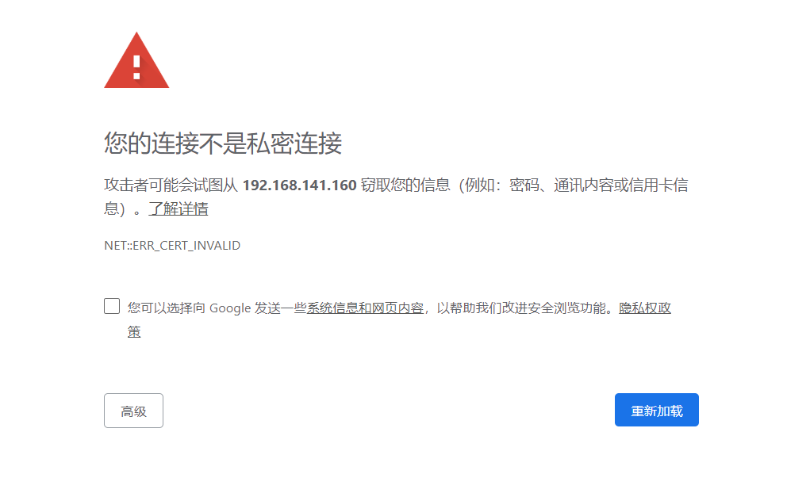
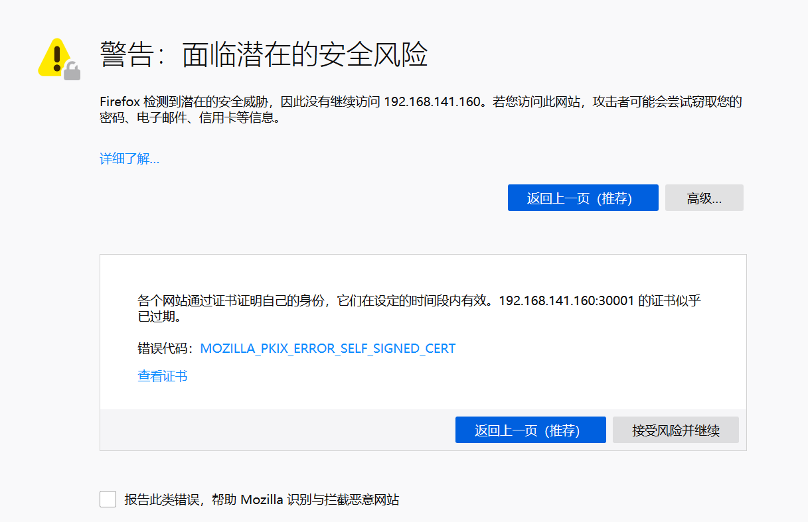
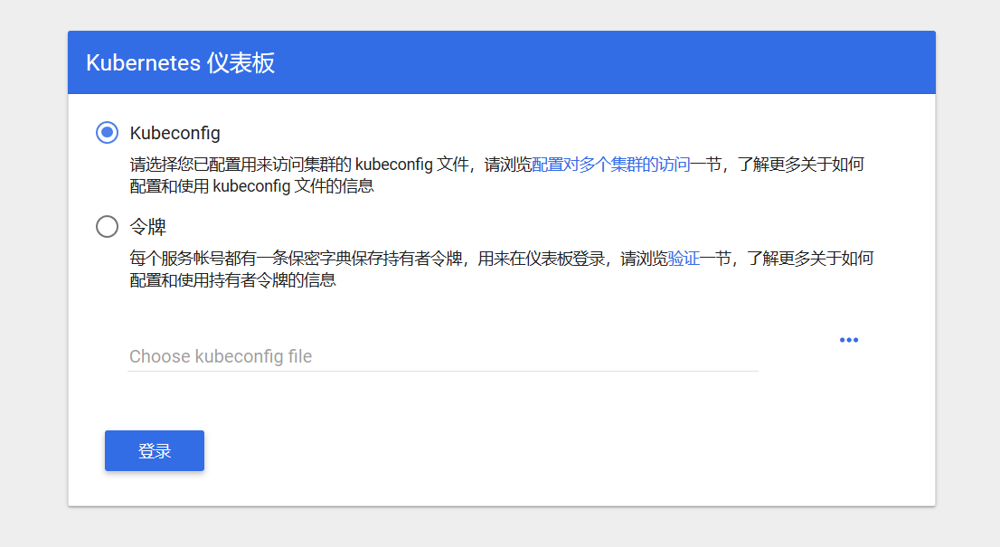
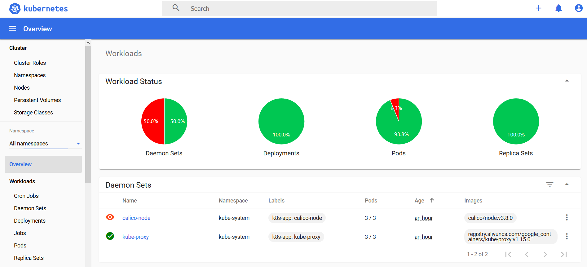

### 概述

Kubernetes Dashboard 是 Kubernetes 集群的 Web UI，用于管理集群。

### 安装

GitHub 地址：[Kubernetes Dashboard](https://github.com/kubernetes/dashboard)


下载配置文件

```
wget https://raw.githubusercontent.com/kubernetes/dashboard/v2.0.0-beta2/aio/deploy/recommended.yaml
```

修改配置如下

```
# 省略部分代码...
# ------------------- Dashboard Service ------------------- #

kind: Service
apiVersion: v1
metadata:
  labels:
    k8s-app: kubernetes-dashboard
  name: kubernetes-dashboard
  namespace: kube-system
spec:
  # 修改类型为 NodePort 访问
  type: NodePort
  ports:
    - port: 443
      targetPort: 8443
      # 设置端口号为 30001
      nodePort: 30001
  selector:
    k8s-app: kubernetes-dashboard
```

部署到集群

```
# 部署
kubectl create -f recommended.yaml

# 查看
kubectl -n kubernetes-dashboard get pods
kubectl -n kubernetes-dashboard get service kubernetes-dashboard
kubectl -n kubernetes-dashboard describe service kubernetes-dashboard
```

### 访问

需要使用 NodeIP:30001 访问 Dashboard，因为证书原因除火狐浏览器外其它浏览器无法直接打开页面

Chrome 浏览器显示如下



Firefox 浏览器显示如下



点击 **接受风险并继续** 即可显示欢迎界面



### 登录

我们采用 Token 方式登录

- 创建登录账号，创建一个名为 **dashboard-adminuser.yaml** 的配置文件

```
apiVersion: v1
kind: ServiceAccount
metadata:
  name: admin-user
  namespace: kubernetes-dashboard
---
apiVersion: rbac.authorization.k8s.io/v1
kind: ClusterRoleBinding
metadata:
  name: admin-user
roleRef:
  apiGroup: rbac.authorization.k8s.io
  kind: ClusterRole
  name: cluster-admin
subjects:
- kind: ServiceAccount
  name: admin-user
  namespace: kubernetes-dashboard
 ```
 
 ```
 kubectl create -f dashboard-adminuser.yaml
 ```
 
-  打印 Token 信息

```
kubectl -n kubernetes-dashboard describe secret $(kubectl -n kubernetes-dashboard get secret | grep admin-user | awk '{print $1}')

# 输出如下
Name:         admin-user-token-2v8vd
Namespace:    kubernetes-dashboard
Labels:       <none>
Annotations:  kubernetes.io/service-account.name: admin-user
              kubernetes.io/service-account.uid: f6f23bc9-3f34-4452-9977-8915e77fbef3

Type:  kubernetes.io/service-account-token

Data
====
namespace:  20 bytes
token:      eyJhbGciOiJSUzI1NiIsImtpZCI6IiJ9.eyJpc3MiOiJrdWJlcm5ldGVzL3NlcnZpY2VhY2NvdW50Iiwia3ViZXJuZXRlcy5pby9zZXJ2aWNlYWNjb3VudC9uYW1lc3BhY2UiOiJrdWJlcm5ldGVzLWRhc2hib2FyZCIsImt1YmVybmV0ZXMuaW8vc2VydmljZWFjY291bnQvc2VjcmV0Lm5hbWUiOiJhZG1pbi11c2VyLXRva2VuLTJ2OHZkIiwia3ViZXJuZXRlcy5pby9zZXJ2aWNlYWNjb3VudC9zZXJ2aWNlLWFjY291bnQubmFtZSI6ImFkbWluLXVzZXIiLCJrdWJlcm5ldGVzLmlvL3NlcnZpY2VhY2NvdW50L3NlcnZpY2UtYWNjb3VudC51aWQiOiJmNmYyM2JjOS0zZjM0LTQ0NTItOTk3Ny04OTE1ZTc3ZmJlZjMiLCJzdWIiOiJzeXN0ZW06c2VydmljZWFjY291bnQ6a3ViZXJuZXRlcy1kYXNoYm9hcmQ6YWRtaW4tdXNlciJ9.d7TVh5L9OKBLY62FXF8ZDjp7dZMH6hmOgd0QKCwPaNEGL_pzJrz1j5JC0TlSaQgFXJKVhUq3WzBsKC2yAsgOc53AKNfJbv0UWKVk5sLXwi79rZiaUdB6cGHOVxiMxUHsluhDAs7DoALyOT3svY5JSh_f5f5h92ZUxBTx5CeFHr47B_MnjG0kgeRR7p8i2vV1OLnW0JQDg-eI0usfFYIzjBy3z1NiVjJJ8ON_ygUNapSXQLuLanjv0Vei_XVTaxfqL9-8AabSm_VDo-mTkqDJWK-utBvQ1AajOWs9fbz8ey6GiC33KevaxxPjNvKfIJI2h0FvDUffy6qysT-IuN2ZEA
ca.crt:     1025 bytes
```

- 将 Token 输入浏览器，成功登陆后效果如下


