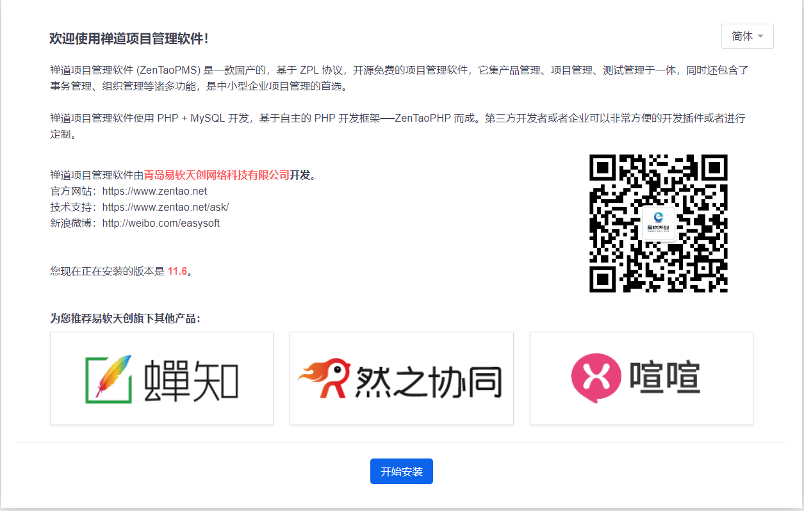
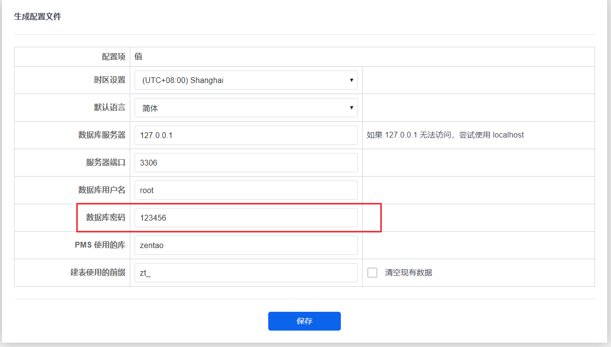
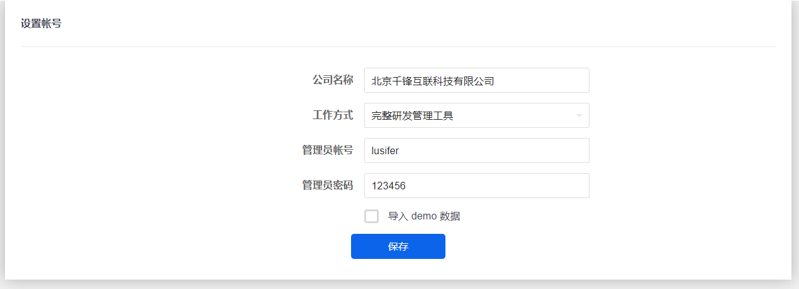
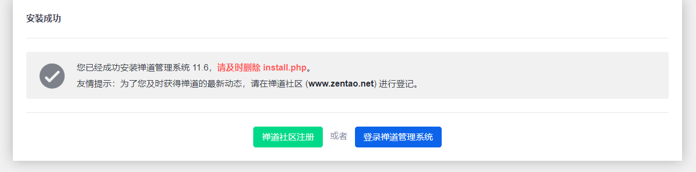
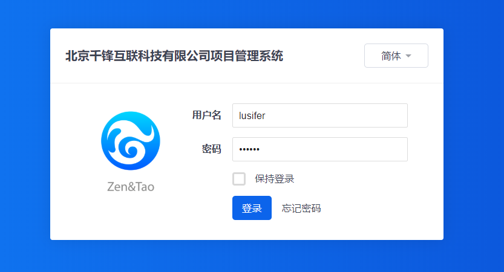
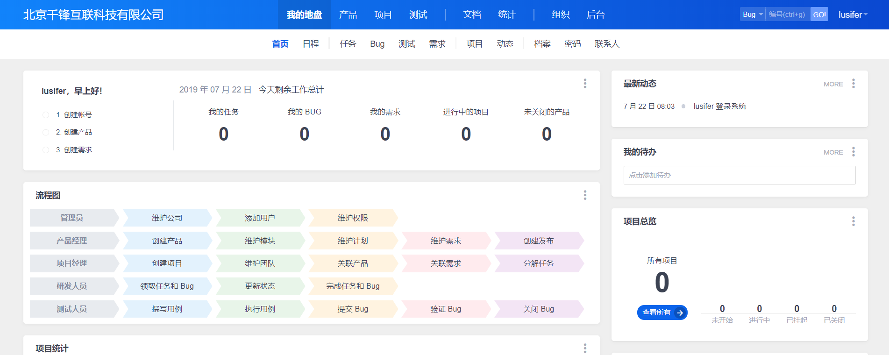

### 原版下载

- 禅道开源版：http://dl.cnezsoft.com/zentao/docker/docker_zentao.zip

- 数据库配置（可以设置 **MYSQL_ROOT_PASSWORD** 变量来更改密码）：

    - **账号**： root

    - **密码**： 123456

- 可挂载目录

    - **/app/zentaopms**: 该目录为禅道目录，里面包含禅道代码及附件上传目录
    
    - **/var/lib/mysql**: 该目录为数据库的数据目录

### Compose

解压 **docker_zentao.zip** 后修改目录名为 **build**，增加 **docker-compose.yml** 配置如下

```
version: '3.1'
services:
  zendao:
    build: build
    restart: always
    container_name: zendao
    environment:
      MYSQL_ROOT_PASSWORD: 123456
    ports:
      - 80:80
    volumes:
      - ./app:/app/zentaopms
      - ./data:/var/lib/mysql
```

```
# 构建镜像
docker-compose build
# 启动容器
docker-compose up -d
```

### 安装












