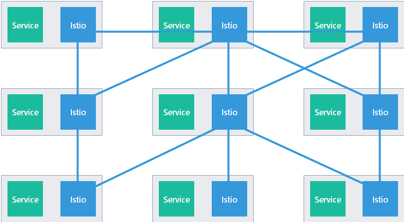
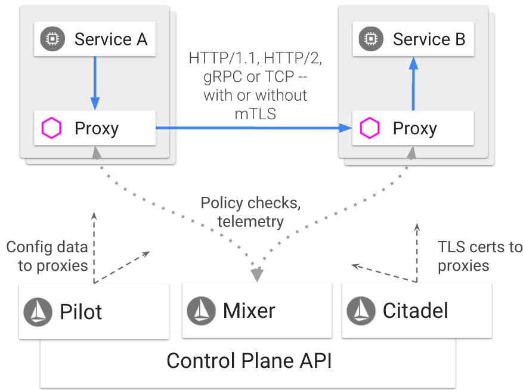

## 什么是服务网格

术语服务网格（Service Mesh）用于描述微服务之间的网络，以及通过此网络进行的服务之间的交互。随着服务数量和复杂度的增加，服务网格将变的难以理解和管理，对服务网格的需求包括：

- 服务发现

- 负载均衡

- 故障恢复

- 指标和监控

- A / B 测试

- 金丝雀发布

- 流量控制

- 访问控制

- 端对端身份验证

## 什么是 Istio

Istio 是运行于分布式应用程序之上的 **非侵入式（无代码入侵）服务网格系统**，它的主要目的是为了更好更轻松的解决服务治理问题（Istio 是一套非侵入式一站式服务治理解决方案）

Istio 的实现原理是，为每个微服务部署一个 **Sidecar**，代理微服务之间的所有网络通信。在此基础上你可以通过 Istio 的控制平面实现：

- 针对 HTTP、gRPC、WebSocket、TCP 流量的负载均衡

- 细粒度的流量控制行为，包括路由、重试、故障转移、故障注入

- 可拔插的策略层 + 配置 API，实现访问控制、限速、配额

- 自动收集指标、日志，跟踪集群内所有流量，包括 Ingress/Egress

- 基于强身份认证和授权来保护服务之间的通信

## Istio 核心特性

### 流量管理

使用 Istio 你可以很容易的通过配置，对流量和 API 调用进行控制。服务级别的可配置属性包括断路器、超时、重试，Istio 支持基于流量百分比切分的 A/B 测试、金丝雀滚动发布、分阶段滚动发布

### 安全性

可以提供安全信道，管理身份验证和授权，加密通信流量，联用 K8S 的网络策略可以获得更多益处，例如保护 Pod-to-Pod 之间的通信

### 可观察性

Istio 强大的跟踪、监控、日志能力，让服务网格内部结构更容易观察（一个服务的性能对上下游的影响可以直观的展现在仪表盘上）

## Istio 架构

从整体上看，Istio 的服务网格由数据平面、控制平面两部分组成：

- **数据平面：** 由一系列作为 Sidecar 部署的智能代理（Envoy）构成。这些代理联合 Mixer， 中继、控制所有微服务之间的网络通信。需要注意，还有一些 Envoy 是独立部署（而非 Sidecar）的，用来实现 K8S Ingress 控制器、Istio 的 Ingress/Egress 网关

- **控制平面：** 负责管理、配置智能代理，实现流量路由；配置 Citadel 实现 TLS 证书管理；配置 Mixers 来应用策略、收集指标

### Envoy

Istio 使用一个扩展过的 Envoy 版本。Envoy 是基于 C++ 开发的高性能代理，Istio 使用它的以下特性：

- 动态服务发现

- 负载均衡

- TLS termination（可将后端的 HTTP 服务包装为 HTTPS）

- HTTP/2 和 gRPC 代理

- 断路器

- 健康检查

- 分阶段（基于流量百分比）发布

- 故障注入

- 丰富的监控指标

一般情况下 Envoy 在和目标服务的相同 Pod 中，以 Sidecar 形式部署。少量的 Istio 组件的主进程就是 Envoy，包括 Ingress 控制器、Ingress/Egress 网关

### Mixer

一个平台无关的组件：

- 为服务网格应用访问控制策略

- 从 Envoy 和其它服务中收集指标

- Envoy 收集的请求级别的属性，被发送到 Mixer 进行分析

Mixer 提供了一个灵活的插件模型，让 Istio 能够灵活的和多种宿主机环境、基础设施后端进行对接

### Pilot

该组件是 Istio 的控制器，它会监控各种规则、策略（通常存储在 K8S 中），一旦配置文件发生变化，就会提取、处理，并同步给 Envoy：

- 为 Envoy 提供服务发现

- 为智能路由（AB 测试、金丝雀部署）提供流量管理能力

- 提供弹性（超时、重试、断路器）

- 分发身份验证策略给 Envoy

Pilot 将高级别的路由规则转换为 Envoy 理解的配置信息，并在运行时将这些配置传播到 Sidecars，Pilot 将平台相关的服务发现机制抽象为标准的（Envoy data plane API，xDS）格式，这让 Istio 可以在 K8S、Consul、Nomad 等多种环境下运行

### Citadel

提供服务与服务之间、或者针对终端用户的身份验证功能，可以加密服务网格中的流量

### Kiali

为我们提供了查看相关服务与配置提供了统一化的可视化界面，并且能在其中展示他们的关联；同时他还提供了界面让我们可以很方便的验证 istio 配置与错误提示