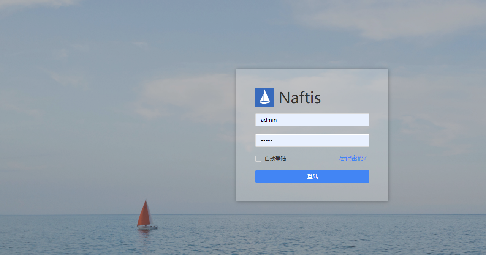
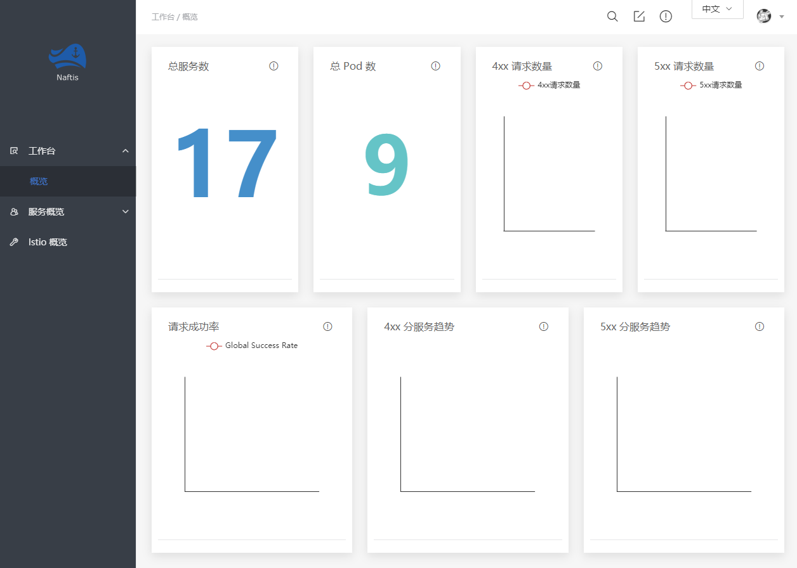

## 概述

本节视频演示采用的是 Kubernetes v1.15.4 版集群环境，Helm 版本为 v2.14.3，安装的 Istio 版本为 v1.4，按照当前课件发布时间（2019 年 11 月 15 日），官方文档说明中指出只在 K8S 的 v1.13、v1.14、v1.15 做过测试，**请暂时不要将 K8S 升级至 v1.16 版**

安装过程参考 [**Istio 官网**](http://www.qfdmy.com/wp-content/themes/quanbaike/go.php?url=aHR0cHM6Ly9pc3Rpby5pby9kb2NzL3NldHVwL2dldHRpbmctc3RhcnRlZC8=) ，Kubernetes 直接安装会安装到最新版，截止本课件发布时间点，最新 K8S 版本为 v1.16.x，我们需要安装特定版本的 K8S 集群

## 部署流程

### 添加 Istio 到 Helm 仓库

```
helm repo add istio.io https://storage.googleapis.com/istio-release/releases/1.4.0/charts/

# 输出如下
"istio.io" has been added to your repositories
```

### 下载 Istio

> **注意：** 已将该文件上传至群分享中

```
wget https://github.com/istio/istio/releases/download/1.4.0/istio-1.4.0-linux.tar.gz

tar -zxvf istio-1.4.0-linux.tar.gz
mv istio-1.4.0 istio
cd istio
```


### 部署 Istio

- 创建命名空间

```
kubectl create namespace istio-system

# 输出如下
namespace/istio-system created
```

- 安装 CRDs (Custom Resource Definitions)

```
helm template install/kubernetes/helm/istio-init --name istio-init --namespace istio-system | kubectl apply -f -

# 输出如下
serviceaccount/istio-init-service-account created
clusterrole.rbac.authorization.k8s.io/istio-init-istio-system created
clusterrolebinding.rbac.authorization.k8s.io/istio-init-admin-role-binding-istio-system created
job.batch/istio-init-crd-10-1.4.0 created
job.batch/istio-init-crd-11-1.4.0 created
job.batch/istio-init-crd-14-1.4.0 created
```

- 等待 CRDs 创建完成

```
kubectl -n istio-system wait --for=condition=complete job --all

# 输出如下
job.batch/istio-init-crd-10-1.4.0 condition met
job.batch/istio-init-crd-11-1.4.0 condition met
job.batch/istio-init-crd-14-1.4.0 condition met
```

- 部署 Istio 到集群

```
helm template install/kubernetes/helm/istio --name istio --namespace istio-system | kubectl apply -f -
```

### 验证部署是否成功

```
kubectl get svc -n istio-system
```

```
kubectl get pods -n istio-system

# 输出如下
NAME                                      READY   STATUS      RESTARTS   AGE
## 证书管理
istio-citadel-8575bd45c6-5z54b            1/1     Running     0          11m
## 配置检查
istio-galley-7f8b95bff6-kb8xz             1/1     Running     0          11m
## 入口网关
istio-ingressgateway-dfbdff6cc-f2tvm      1/1     Running     0          11m
istio-init-crd-10-1.4.0-7ls2s             0/1     Completed   0          18m
istio-init-crd-11-1.4.0-rrb7q             0/1     Completed   0          18m
istio-init-crd-14-1.4.0-kmmkm             0/1     Completed   0          18m
## Envoy 服务发现，外部化配置
istio-pilot-7f7b96db54-vdrs9              2/2     Running     3          11m
## Mixer 策略检查
istio-policy-5899c5f9b4-ch9ht             2/2     Running     6          11m
## 边车注入
istio-sidecar-injector-6c9d6cd87c-wrb7t   1/1     Running     0          11m
## Mixer 指标收集
istio-telemetry-6cb4749497-4p5tw          2/2     Running     6          11m
## 监控报警
prometheus-8685f659f-zzznv                1/1     Running     0          11m
```

## 部署 Istio 控制面板

我们采用小米开源的 `Naftis` 作为我们的控制面板。[Naftis](http://www.qfdmy.com/wp-content/themes/quanbaike/go.php?url=aHR0cHM6Ly9naXRodWIuY29tL3hpYW9taS9uYWZ0aXMvYmxvYi9tYXN0ZXIvUkVBRE1FLUNOLm1k) 是一个基于 Web 的 Istio Dashboard，通过任务模板的方式来帮助用户更方便地执行 Istio 任务。 用户可以在 Naftis 中定义自己的任务模板，并填充变量来构造单个或多个构造任务实例，从而完成各种服务治理功能

### 部署 Naftis

- 下载最新 Release 文件和部署清单

```
wget -O - https://raw.githubusercontent.com/XiaoMi/naftis/master/tool/getlatest.sh | bash
```

- 创建 Naftis 命名空间

```
kubectl create namespace naftis

# 输出如下
namespace/naftis created
```

- 部署 Naftis MySQL 服务

```
kubectl apply -n naftis -f mysql.yaml

# 输出如下
persistentvolume/naftis-pv created
secret/naftis-mysql created
configmap/naftis-mysql-initialization created
configmap/naftis-mysql-test created
persistentvolumeclaim/naftis-mysql created
service/naftis-mysql created
pod/naftis-mysql-test created
deployment.extensions/naftis-mysql created
```

- 确认 MySQL 已部署

```
kubectl get pods -n naftis

# 输出如下
NAME                            READY   STATUS    RESTARTS   AGE
naftis-mysql-5f95ffbdbc-85ggw   1/1     Running   0          92s
naftis-mysql-test               1/1     Running   0          92s
```

- 部署 Naftis API 和 UI 服务

```
kubectl apply -n naftis -f naftis.yaml

# 输出如下
Warning: kubectl apply should be used on resource created by either kubectl create --save-config or kubectl apply
namespace/naftis configured
configmap/naftis-config created
clusterrolebinding.rbac.authorization.k8s.io/naftis-rbac created
service/naftis-api created
service/naftis-ui created
deployment.extensions/naftis-ui created
deployment.extensions/naftis-api created
```

- 确认 Naftis 所有的服务已经正确定义并正常运行中

```
kubectl get svc -n naftis

# 输出如下
NAME           TYPE           CLUSTER-IP       EXTERNAL-IP   PORT(S)        AGE
naftis-api     ClusterIP      10.96.58.36      <none>        50000/TCP      45s
naftis-mysql   ClusterIP      10.99.66.184     <none>        3306/TCP       3m
naftis-ui      LoadBalancer   10.110.105.103   <pending>     80:30772/TCP   44s

kubectl get pod -n naftis

# 输出如下
NAME                            READY   STATUS    RESTARTS   AGE
naftis-api-7d6f47fbcc-qsfpg     1/1     Running   0          22m
naftis-mysql-5f95ffbdbc-85ggw   1/1     Running   0          24m
naftis-mysql-test               1/1     Running   0          22m
naftis-ui-9d66dbc74-l8lsx       1/1     Running   0          22m
```

### 访问 Naftis

- 使用端口转发的方式暴露端口

```
kubectl -n naftis port-forward $(kubectl -n naftis get pod -l app=naftis-ui -o jsonpath='{.items[0].metadata.name}') 32569:80 --address 0.0.0.0 &
```

- 在任意 K8S 节点上访问 32569 端口（**账号：admin 密码：admin**）





## 卸载 Istio

```
cd istio

helm template install/kubernetes/helm/istio --name istio --namespace istio-system | kubectl delete -f -
```


```
helm delete --purge istio
helm delete --purge istio-init
helm delete --purge istio-cni
```

```
kubectl delete -f install/kubernetes/helm/istio-init/files
kubectl delete namespace istio-system
```

## 卸载 Naftis

```
cd naftis

kubectl delete -n naftis -f naftis.yaml
kubectl delete -n naftis -f mysql.yaml
kubectl delete namespace naftis
```

## 附：集群环境安装参考

### 安装特定版本的 Kubernetes

```
# 更新软件源
sudo apt-get update

# 安装所需依赖
sudo apt-get -y install apt-transport-https ca-certificates curl software-properties-common

# 安装 GPG 证书
curl https://mirrors.aliyun.com/kubernetes/apt/doc/apt-key.gpg | apt-key add -

# 写入软件源；注意：我们用系统代号为 bionic，但目前阿里云不支持，所以沿用 16.04 的 xenial
cat << EOF >/etc/apt/sources.list.d/kubernetes.list
deb https://mirrors.aliyun.com/kubernetes/apt/ kubernetes-xenial main
EOF

# 安装特定版本的 Kubernetes
apt-get update && apt-get install -y kubelet=1.15.4-00 kubeadm=1.15.4-00 kubectl=1.15.4-00
```

### 安装 Helm

- 安装客户端 Helm

```
# 下载
wget https://get.helm.sh/helm-v2.14.3-linux-amd64.tar.gz

# 解压
tar -zxvf helm-v2.14.3-linux-amd64.tar.gz

# 复制客户端执行文件到 bin 目录下
cp linux-amd64/helm /usr/local/bin/
```

- 安装服务端 Tiller

```
helm init --upgrade --tiller-image registry.cn-hangzhou.aliyuncs.com/google_containers/tiller:v2.14.3 --stable-repo-url http://mirror.azure.cn/kubernetes/charts/

# 输出如下
Creating /root/.helm 
Creating /root/.helm/repository 
Creating /root/.helm/repository/cache 
Creating /root/.helm/repository/local 
Creating /root/.helm/plugins 
Creating /root/.helm/starters 
Creating /root/.helm/cache/archive 
Creating /root/.helm/repository/repositories.yaml 
Adding stable repo with URL: http://mirror.azure.cn/kubernetes/charts/ 
Adding local repo with URL: http://127.0.0.1:8879/charts 
$HELM_HOME has been configured at /root/.helm.
Tiller (the Helm server-side component) has been installed into your Kubernetes Cluster.
Please note: by default, Tiller is deployed with an insecure 'allow unauthenticated users' policy.
To prevent this, run `helm init` with the --tiller-tls-verify flag.
For more information on securing your installation see: https://docs.helm.sh/using_helm/#securing-your-helm-installation
```

- 创建一个名为 `tiller-adminuser.yaml` 的配置文件，为 Tiller 创建服务帐号和绑定角色

```
apiVersion: v1
kind: ServiceAccount
metadata:
  name: tiller
  namespace: kube-system
---
apiVersion: rbac.authorization.k8s.io/v1
kind: ClusterRoleBinding
metadata:
  name: tiller-cluster-rule
roleRef:
  apiGroup: rbac.authorization.k8s.io
  kind: ClusterRole
  name: cluster-admin
subjects:
- kind: ServiceAccount
  name: tiller
  namespace: kube-system
```

```
kubectl apply -f tiller-adminuser.yaml
```


- 为 Tiller 设置帐号

```
kubectl patch deploy --namespace kube-system tiller-deploy -p '{"spec":{"template":{"spec":{"serviceAccount":"tiller"}}}}'

# 输出如下
deployment.extensions/tiller-deploy patched
```

- 查看是否授权成功

```
kubectl get deploy --namespace kube-system tiller-deploy --output yaml|grep  serviceAccount

# 输出如下
serviceAccount: tillerserviceAccountName: tiller
```

- 验证安装是否成功

```
helm version

# 输出如下
Client: &version.Version{SemVer:"v2.14.3", GitCommit:"0e7f3b6637f7af8fcfddb3d2941fcc7cbebb0085", GitTreeState:"clean"}
Server: &version.Version{SemVer:"v2.14.3", GitCommit:"0e7f3b6637f7af8fcfddb3d2941fcc7cbebb0085", GitTreeState:"clean"}
```